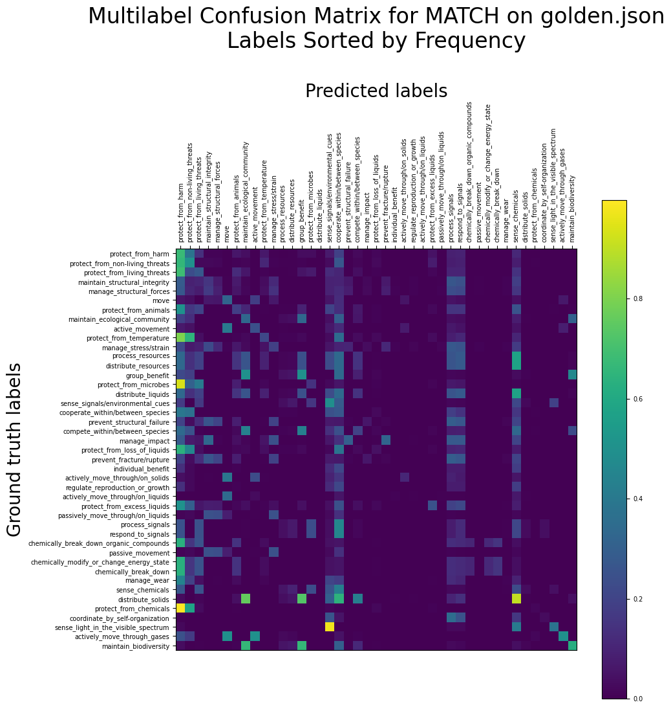
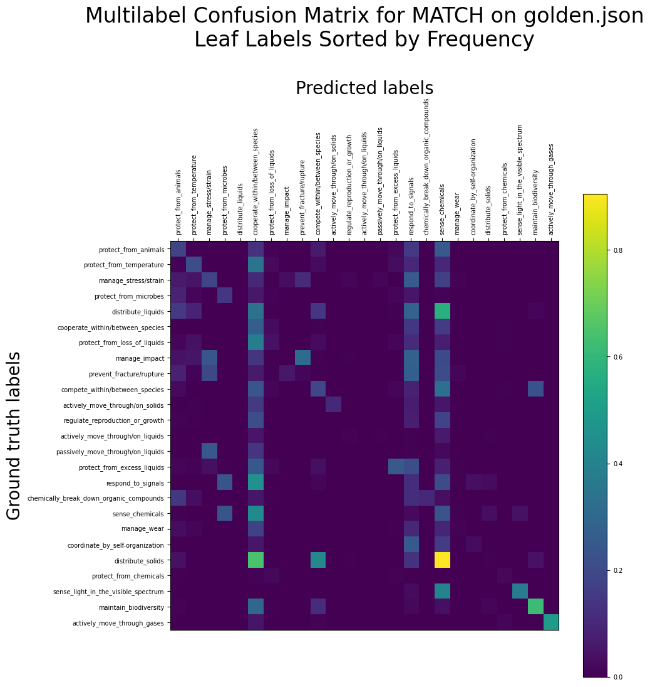

# MATCH on PeTaL Data

## Links

- [What is this?](#overview)
- [What are all these files?](#contents)
- [How do I reproduce your results?](#run)
- [Summary of Results](#results)
- [Frequently Asked Questions](#faq)
- [Future Work](#future)
- [Contact](#contact)

## What is this? <a name="overview"></a>

This directory contains work done for investigating the use of the MATCH (https://github.com/yuzhimanhua/MATCH) algorithm to classify PeTaL data according to the PeTaL taxonomy.

This README was last updated on 29 July 2021.

## What are all these files? <a name="contents"></a>

- `analysis/` contains scripts for analysing experiment data and results.
- `experiment_data/` contains cleaned-up experiment logs for various sets of trials.
- `notebooks/` contains Jupyter notebooks for exploring the use of MATCH on PeTaL data. The source of primary development until roughly 2021-07-14.
- `plots/` contains matplotlib plots generated by `notebooks/prediction_metrics.ipynb`.
- `reports/` contains historical results and analyses thereof, as well as some figures for them in `reports/figures/`.
- `src/` contains python source files and other source files needed for reproducing this work in a non-notebook environment. Probably the source of primary development from 2021-07-14 onward.
- `Makefile` is a simple Makefile for building the setup and cleaning.
- `README.md` is this (self-referential) document.
- `requirements.txt` contains a list of required packages.
- `setup.py`, for setting up preliminaries (i.e., downloading PeTaL).

## How do I reproduce your results? <a name="run"></a>

### Environment and setup

If you haven't done this already, clone this repository and `cd` to here, `PeTaL-Labeller/auto-labeler/MATCH`.

This project is run in Python 3.6. In order to faithfully reproduce our environment, we recommend using a conda environment,

```
conda create --name match-env python=3.6.8
conda activate match-env
```

installing dependencies through pip,

```
pip install -r requirements.txt
```

and downloading the PeTaL dataset using

```
python setup.py [--verbose]
```

or, alternatively,

```
make
```
(which currently just calls `python setup.py --verbose`).

### Running the main MATCH pipeline - preprocessing, training, evaluation

To run the main pipeline, navigate to `src/` and follow its README. In short, this will be

```
cd src
python run_MATCH_with_PeTaL_data.py --cnf config.yaml [--verbose]
```

or, step by step,

```
cd src
python preprocess.py --cnf config.yaml [--verbose]
python train.py --cnf config.yaml [--verbose]
python eval.py --cnf config.yaml [--verbose]
```

where `[--verbose]` is an optional parameter.

### Everybody clean up!

There is also the command

```
make clean
```

should you want to remove the dataset that `setup.py` downloaded. This is necessary if you want to download an updated version of the dataset.

## Summary of results <a name="results"></a>

In short, what I've found so far seems to indicate that:
- for the scale of our data in `PeTaL/golden.json` (roughly 1200 papers), dataset size matters a lot. This is encouraging.
- among other metadata, appending MAG fields of study and MeSH terms to text does help accuracy. MAG fields of study alone give somewhat more information than MeSH terms alone.
- for now, MATCH is quite definitely overfitting on `PeTaL/golden.json`.

Cleaned experiment logs for various sets of trials are found in `experiment_data/`.

Historical analyses of results are available in `reports/results_up_to_20210714.md`.

### 2021-07-28 Issue #73 testing on `golden.json` - Using Only The Labels At The Highest Level.

In the PeTaL taxonomy there are ten Level 1 labels. Their frequencies of occurrence in `golden.json` are plotted in the following graph.


The following are the precisions and nDCG scores of MATCH on only the level 1 labels. P@3, P@5, nDCG@3, and nDCG@5 are largely without meaning, because most papers have only one level 1 label. The performance is roughly on par with MATCH performance on the entire tree of labels; I am not sure why it is not higher.

| Train set options | P@1=nDCG@1 | P@3 | P@5 | nDCG@3 | nDCG@5 |
| --- | --- | --- | --- | --- | --- |
| level1 | 0.621 ± 0.032 | 0.339 ± 0.025 | 0.239 ± 0.015 | 0.684 ± 0.030 | 0.732 ± 0.027 |

P@k refers to precision at top k and nDCG@k refers to Normalized Discounted Cumulative Gain at top k. For more detail on what these are see the [FAQ](#p-and-ndcg).

A multilabel confusion matrix showing what each label tends to be classified as is shown below:


### 2021-07-27 Ablation Studies - `golden.json`.

Overnight we ran the same suite of ablation studies on `golden.json` and obtained the following results.

| Train set options | P@1=nDCG@1 | P@3 | P@5 | nDCG@3 | nDCG@5 |
| --- | --- | --- | --- | --- | --- |
| golden_all | 0.584 ± 0.055 | 0.485 ± 0.032 | 0.382 ± 0.027 | 0.513 ± 0.036 | 0.510 ± 0.034 |
| golden_no_mag | 0.533 ± 0.037 | 0.447 ± 0.029 | 0.352 ± 0.020 | 0.473 ± 0.028 | 0.469 ± 0.024 |
| golden_no_mesh | 0.562 ± 0.057 | 0.472 ± 0.061 | 0.373 ± 0.046 | 0.498 ± 0.060 | 0.495 ± 0.058 |
| golden_no_venue | 0.544 ± 0.044 | 0.437 ± 0.041 | 0.354 ± 0.037 | 0.467 ± 0.042 | 0.471 ± 0.044 |
| golden_no_author | 0.596 ± 0.051 | 0.487 ± 0.038 | 0.379 ± 0.032 | 0.519 ± 0.039 | 0.512 ± 0.040 |
| golden_no_ref | 0.568 ± 0.047 | 0.472 ± 0.053 | 0.373 ± 0.038 | 0.499 ± 0.052 | 0.495 ± 0.046 |
| golden_no_text | 0.571 ± 0.053 | 0.486 ± 0.046 | 0.379 ± 0.037 | 0.511 ± 0.047 | 0.506 ± 0.045 |
| golden_only_mag | 0.519 ± 0.053 | 0.412 ± 0.046 | 0.327 ± 0.032 | 0.440 ± 0.046 | 0.437 ± 0.040 |
| golden_only_mesh | 0.308 ± 0.035 | 0.228 ± 0.022 | 0.194 ± 0.017 | 0.245 ± 0.023 | 0.253 ± 0.019 |
| golden_only_venue | 0.592 ± 0.051 | 0.533 ± 0.039 | 0.434 ± 0.041 | 0.551 ± 0.040 | 0.557 ± 0.039 |
| golden_only_author | 0.362 ± 0.053 | 0.287 ± 0.045 | 0.235 ± 0.027 | 0.307 ± 0.047 | 0.309 ± 0.040 |
| golden_only_ref | 0.449 ± 0.057 | 0.370 ± 0.067 | 0.310 ± 0.051 | 0.392 ± 0.063 | 0.403 ± 0.059 |
| golden_only_text | 0.308 ± 0.035 | 0.231 ± 0.022 | 0.201 ± 0.017 | 0.246 ± 0.022 | 0.258 ± 0.021 |
| golden_none | 0.308 ± 0.035 | 0.230 ± 0.020 | 0.196 ± 0.014 | 0.245 ± 0.021 | 0.255 ± 0.017 |

P@k refers to precision at top k and nDCG@k refers to Normalized Discounted Cumulative Gain at top k. For more detail on what these are see the [FAQ](#p-and-ndcg).

This was alarming, in that *the text itself appeared to be giving no information at all*. It turned out that the text was being lost during the preprocessing stage (because in `golden.json`, there is no `text` field, but just `title` and `abstract` fields) and I had forgotten to account for that. The data involving the `text` field above are therefore flawed, and a fixed set of trials were run, whose results are shown below.

| Train set options | P@1=nDCG@1 | P@3 | P@5 | nDCG@3 | nDCG@5 |
| --- | --- | --- | --- | --- | --- |
| fixed_golden_all | 0.570 ± 0.053 | 0.471 ± 0.035 | 0.370 ± 0.032 | 0.499 ± 0.038 | 0.495 ± 0.039 |
| fixed_golden_no_text | 0.554 ± 0.050 | 0.458 ± 0.043 | 0.364 ± 0.034 | 0.485 ± 0.044 | 0.484 ± 0.041 |
| fixed_golden_only_text | 0.501 ± 0.033 | 0.373 ± 0.029 | 0.294 ± 0.021 | 0.406 ± 0.030 | 0.402 ± 0.027 |

From this we see that text is giving some information, but it does not appreciably improve the final result. (In other words, the metadata give enough information to make the text redundant.)

### 2021-07-27 Multilabel Confusion Matrices - `golden.json`.

We plot multilabel confusion matrices for the top 25% of leaf labels for MATCH on `golden.json`, for issues #65 and #70.





### 2021-07-27 Increasing the number of transformer layers on `golden.json`

We increase the number of transformer layers for MATCH on `golden.json` to see if that makes a difference. Our preliminary investigations seem to indicate that increasing number of layers beyond 4 is not fruitful. In fact, with any more than 6 transformer layers, it is impossible for the GPU on `triglav.grc.nasa.gov` to fit the entire model.

| Train set options | P@1=nDCG@1 | P@3 | P@5 | nDCG@3 | nDCG@5 |
| --- | --- | --- | --- | --- | --- |
| golden_3_layer | 0.552 ± 0.108 | 0.471 ± 0.056 | 0.365 ± 0.045 | 0.495 ± 0.068 | 0.487 ± 0.064 |
| golden_4_layer | 0.597 ± 0.059 | 0.489 ± 0.041 | 0.392 ± 0.031 | 0.521 ± 0.045 | 0.523 ± 0.040 |
| golden_6_layer | 0.597 ± 0.044 | 0.496 ± 0.045 | 0.392 ± 0.037 | 0.525 ± 0.044 | 0.521 ± 0.042 |

P@k refers to precision at top k and nDCG@k refers to Normalized Discounted Cumulative Gain at top k. For more detail on what these are see the [FAQ](#p-and-ndcg).

### 2021-07-27 Dataset size testing on `golden.json`

Although we report no improvement over the equivalent tests on `cleaned_lens_output.json`, we confirm that MATCH performance increases roughly linearly with respect to dataset size on `golden.json`.

| Train set size | P@1=nDCG@1 | P@3 | P@5 | nDCG@3 | nDCG@5 |
| --- | --- | --- | --- | --- | --- |
| 248 | 0.315 ± 0.020 | 0.242 ± 0.022 | 0.208 ± 0.012 | 0.262 ± 0.022 | 0.273 ± 0.016 |
| 364 | 0.394 ± 0.062 | 0.303 ± 0.048 | 0.248 ± 0.037 | 0.326 ± 0.053 | 0.331 ± 0.052 |
| 481 | 0.437 ± 0.076 | 0.360 ± 0.064 | 0.286 ± 0.046 | 0.381 ± 0.069 | 0.380 ± 0.065 |
| 597 | 0.510 ± 0.031 | 0.405 ± 0.027 | 0.321 ± 0.019 | 0.434 ± 0.028 | 0.431 ± 0.027 |
| 713 | 0.515 ± 0.046 | 0.415 ± 0.036 | 0.332 ± 0.029 | 0.443 ± 0.039 | 0.444 ± 0.039 |
| 829 | 0.568 ± 0.044 | 0.468 ± 0.039 | 0.366 ± 0.027 | 0.496 ± 0.039 | 0.492 ± 0.036 |
| 945 | 0.580 ± 0.050 | 0.478 ± 0.043 | 0.373 ± 0.030 | 0.508 ± 0.045 | 0.501 ± 0.043 |

P@k refers to precision at top k and nDCG@k refers to Normalized Discounted Cumulative Gain at top k. For more detail on what these are see the [FAQ](#p-and-ndcg).

### 2021-07-26 First Tests on `golden.json` - Issue #70

We conducted three sets of ten trials. The first involved the whole `golden.json` dataset. The second and third involved only the papers labelled with one of the top 25% and top 10% leaf labels, respectively, for PeTaL Labeller Issue #70.

| Train set options | Dataset size | P@1=nDCG@1 | P@3 | P@5 | nDCG@3 | nDCG@5 |
| --- | --- | --- | --- | --- | --- | --- |
| golden_testing | 1161 | 0.552 ± 0.108 | 0.471 ± 0.056 | 0.365 ± 0.045 | 0.495 ± 0.068 | 0.487 ± 0.064 |
| golden_top_25% | 773 | 0.526 ± 0.093 | 0.461 ± 0.074 | 0.357 ± 0.044 | 0.491 ± 0.077 | 0.522 ± 0.069 |
| golden_top_10% | 453 | 0.471 ± 0.113 | 0.274 ± 0.043 | 0.207 ± 0.024 | 0.558 ± 0.092 | 0.626 ± 0.081 |

P@k refers to precision at top k and nDCG@k refers to Normalized Discounted Cumulative Gain at top k. For more detail on what these are see the [FAQ](#p-and-ndcg).

It seems that the advantage gained by restricting the papers to only the most common labels is outweighed by the disadvantage of having a smaller dataset. Also observe that the nDCG scores increase as the dataset becomes more restricted -- this could be a consequence of the model learning to predict those labels correctly more often, or it could be a consequence of there being fewer labels to predict (and thus, fewer incorrect choices).

## Frequently Asked Questions <a name="faq"></a>

### What do P@1, P@3, nDCG@1, etc., all mean? <a name="p-and-ndcg"></a>

So MATCH produces a ranking of labels (biomimicry functions) by their relevance. There are a lot of labels, but usually only a few are relevant to each document. **Precision at top k** (P@k) asks "Of the top k labels predicted by MATCH, how many is the document actually (ground-truth) tagged with"?

P@k has a shortcoming in that it is not ranking-aware -- it just checks, one by one, whether each predicted label is also a ground-truth label (whereas in reality, some labels can be more relevant than others!). **Normalized Discounted Cumulative Gain at top k** (nDCG@k) is one way to address this issue, by computing the similarity of MATCH's generated ranking to an ideal ranking.

Both P@k and nDCG@k range from 0.0 (completely off the mark) to 1.0 (picture-perfect).

### What values does nDCG use for an ideal ranking, since we don't have relevancy scores for our labels? <a name="ndcg-ranking"></a>

My understanding is the relevancy score for each ground-truth label is a binary yes or no (1 for relevant, 0 for not).

The ordering of the predictions that MATCH makes can still have an effect on the nDCG score, though!

For example, consider two relevant labels (R) and an irrelevant label (NR). If for a certain paper, a prediction at top 3 is (NR, R, R) and another is (R, NR, R) (where R = a relevant label and NR is a non-relevant label), those two predictions would have different nDCG scores. In computing the nDCG score they would both be compared to the ideal partial ordering (R, R, NR).

## Future work <a name="future"></a>

- Integrate this work with the rest of the PeTaL pipeline.
- Compare to [auto-sklearn](https://github.com/nasa-petal/PeTaL-labeller/issues/56)
- Investigate using just the [most common subset of labels](https://github.com/nasa-petal/PeTaL-labeller/issues/70) to see if MATCH does better on that, and write a [binary classifier to filter out the other labels](https://github.com/nasa-petal/PeTaL-labeller/issues/69).
- Look into [data augmentation techniques](https://github.com/nasa-petal/PeTaL-labeller/issues/65).
- conda throws a non-fatal error at the beginning of training? Not sure why, but it still trains well.
- Figure out how to load MATCH with [pretrained weights](https://github.com/nasa-petal/PeTaL-labeller/issues/72).

## Contact <a name="contact"></a>

For questions contact Eric Kong (eric.l.kong@nasa.gov, erickongl@gmail.com).