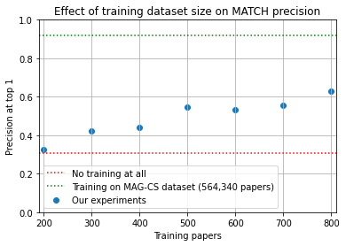
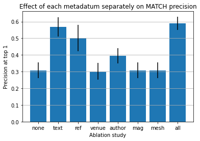
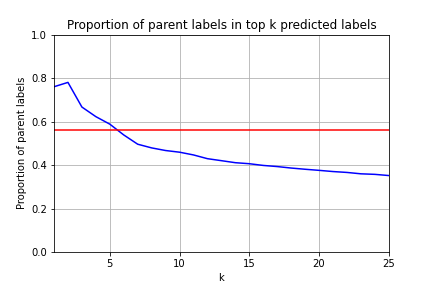

# MATCH on PeTaL Data

## What is this?

This directory contains work done for investigating the use of the MATCH (https://github.com/yuzhimanhua/MATCH) algorithm to classify Lens output data according to the PeTaL taxonomy.

This README was last updated on 16 July 2021.

## What are all these files?

- `experiment_data/` contains raw experiment logs for various sets of trials.
- `PeTaL/` contains the Lens output dataset, including `cleaned_lens_output.json`, `taxonomy.txt`, and `Split.py`. Additionally, `emb_init.npy`, `labels_binarizer`, and `PeTaL.joint.emb` are the result of re-running embedding pre-training on the PeTaL data. The rest of the files are generated in the course of running the Jupyter notebooks, particularly `run_MATCH_with_PeTaL_data.ipynb`.
- `plots/` contains matplotlib plots generated by `prediction_metrics.ipynb`.
- `py/` contains python source files and other source files needed for reproducing this work in a non-notebook environment. Probably the source of primary development from 2021-07-14 onward.
- `MATCH-PeTaL.yaml` is the model configuration file for training MATCH on PeTaL data.
- `PeTaL.yaml` is the dataset configuration file for training MATCH on PeTaL data.
- `prediction_metrics.ipynb`, in progress, is an attempt to compute various classification metrics (precision, recall, F1 score, confusion matrix) for MATCH run on the MAG-CS dataset.
- `README.md` is this (self-referential) document.
- `run_MATCH_with_PeTaL_data.ipynb` is a Jupyter notebook evaluating the performance of MATCH on PeTaL data.
- `transform_data_PeTaL.py` is a version of MATCH's `transform_data.py`, modified to use the PeTaL dataset instead.

## How do I reproduce your results?

- Step through `run_MATCH_with_PeTaL_data.ipynb`.

## Summary of results

In short, what I've found so far seems to indicate that:
- for the scale of our data in `PeTaL/cleaned_lens_output.json` (up to 1000 papers), dataset size matters a lot. This is encouraging.
- appending MAG fields of study and MeSH terms to text may help (at least does not hurt) accuracy.

Raw experiment logs for various sets of trials are found in `experiment_data`.

### Effect of training dataset size on MATCH precision.

Here are the results from my trials:

| Train set size | P@1=nDCG@1 | P@3 | P@5 | nDCG@3 | nDCG@5 |
| --- | --- | --- | --- | --- | --- |
| 200 | 0.324 | 0.249 | 0.203 | 0.269 | 0.274 |
| 300 | 0.424 | 0.337 | 0.275 | 0.362 | 0.364 |
| 400 | 0.441 | 0.344 | 0.278 | 0.373 | 0.373 |
| 500 | 0.547 | 0.419 | 0.328 | 0.454 | 0.447 |
| 600 | 0.534 | 0.433 | 0.345 | 0.464 | 0.463 |
| 700 | 0.555 | 0.434 | 0.342 | 0.466 | 0.472 |
| 800 | 0.627 | 0.509 | 0.390 | 0.542 | 0.543 |

Each training set size was run for 3 trials, whose statistics are averaged in the table above. All trials used 100 papers for validation and the rest of the papers for testing.

This is encouraging for our project, at least because it indicates that we can keep improving precision for roughly linear increase in training dataset size, and that we have not hit a plateau yet.



### Effect of adding MAG fields of study and MeSH terms to text

I performed ablation studies to determine the effect of appending Microsoft Academic Graph (MAG) fields of study or Medical Subject Headings (MeSH) terms to the text. Here are the results from my first trials on June 23:

| Test set P@1 | without MeSH | with MeSH |
| --- | --- | --- |
| without MAG | 0.64 | 0.63 |
| with MAG | 0.61 | 0.67 |

Repeated with 10-fold cross-validation on June 28:

| Train set options | P@1=nDCG@1 | P@3 | P@5 | nDCG@3 | nDCG@5 |
| --- | --- | --- | --- | --- | --- |
| with_mag, with_mesh | 0.590 ± 0.040 | 0.457 ± 0.030 | 0.369 ± 0.025 | 0.495 ± 0.032 | 0.493 ± 0.035 |
| with_mag, no_mesh | 0.583 ± 0.032 | 0.477 ± 0.035 | 0.378 ± 0.029 | 0.508 ± 0.033 | 0.506 ± 0.036 |
| no_mag, with_mesh | 0.573 ± 0.056 | 0.455 ± 0.029 | 0.362 ± 0.034 | 0.488 ± 0.034 | 0.485 ± 0.040 |
| no_mag, no_mesh | 0.569 ± 0.036 | 0.475 ± 0.028 | 0.373 ± 0.026 | 0.504 ± 0.029 | 0.498 ± 0.030 |

Results are **inconclusive**, and I suspect the differences between these trials may not be statistically significant, but adding MeSH terms and MAG fields does not hurt accuracy, nor does it hurt performance (i.e., speed). All trials took roughly 12 minutes to run 1000 epochs on the dataset of 1000 papers (800 training, 100 validation, 100 test).

### Effect of using *wrong* MAG and MeSH labels, &c.

Adding *wrong* MAG and MeSH labels does not seem to have affected the precision of the model in the slightest.

Using *only* MAG and MeSH labels (and no other information, not even text) does not seem to have helped MATCH predict labels any better than chance.

| Train set options | P@1=nDCG@1 | P@3 | P@5 | nDCG@3 | nDCG@5 |
| --- | --- | --- | --- | --- | --- |
| with_mag, with_mesh | 0.590 ± 0.040 | 0.457 ± 0.030 | 0.369 ± 0.025 | 0.495 ± 0.032 | 0.493 ± 0.035 |
| wrong_mag_and_mesh | 0.591 ± 0.034 | 0.466 ± 0.030 | 0.366 ± 0.022 | 0.502 ± 0.028 | 0.495 ± 0.025 |
| only_mag_and_mesh | 0.303 ± 0.053 | 0.223 ± 0.028 | 0.201 ± 0.020 | 0.239 ± 0.031 | 0.254 ± 0.028 |
| nothing at all | 0.307 ± 0.047 | 0.227 ± 0.025 | 0.197 ± 0.014 | 0.243 ± 0.027 | 0.253 ± 0.024 |

If you train MATCH on *nothing at all*, it predicts the following top-5 labels:

```
protect_from_harm
process_resources
protect_from_non-living_threats sense_send_or_process_information
move
```

All of which are level-1 labels (except for `protect_from_non-living_threats`). Presumably these are the top 5 most common labels in the dataset.

### Additional ablation studies

We investigate the effect of removing venue, author, references, and text features (separately).

| Train set options | P@1=nDCG@1 | P@3 | P@5 | nDCG@3 | nDCG@5 |
| --- | --- | --- | --- | --- | --- |
| nothing removed | 0.590 ± 0.040 | 0.457 ± 0.030 | 0.369 ± 0.025 | 0.495 ± 0.032 | 0.493 ± 0.035 |
| NO_VENUE | 0.584 ± 0.045 | 0.454 ± 0.019 | 0.365 ± 0.017 | 0.490 ± 0.023 | 0.489 ± 0.024 |
| NO_AUTHOR | 0.572 ± 0.053 | 0.466 ± 0.042 | 0.367 ± 0.035 | 0.496 ± 0.046 | 0.489 ± 0.046 |
| NO_REFERENCE | 0.556 ± 0.034 | 0.440 ± 0.037 | 0.345 ± 0.030 | 0.472 ± 0.035 | 0.465 ± 0.033 |
| NO_TEXT | 0.490 ± 0.050 | 0.401 ± 0.045 | 0.323 ± 0.032 | 0.427 ± 0.047 | 0.428 ± 0.043 |

We also investigate the effect of including each metadatum by itself, as the only thing MATCH has to go on.

| Train set options | P@1=nDCG@1 | P@3 | P@5 | nDCG@3 | nDCG@5 |
| --- | --- | --- | --- | --- | --- |
| ONLY_TEXT | 0.568 ± 0.058 | 0.449 ± 0.049 | 0.357 ± 0.028 | 0.483 ± 0.049 | 0.481 ± 0.044 |
| ONLY_REFERENCE | 0.502 ± 0.079 | 0.410 ± 0.053 | 0.333 ± 0.038 | 0.436 ± 0.059 | 0.438 ± 0.056 |
| ONLY_VENUE | 0.302 ± 0.049 | 0.232 ± 0.026 | 0.205 ± 0.020 | 0.247 ± 0.028 | 0.261 ± 0.030 |
| ONLY_AUTHOR | 0.395 ± 0.046 | 0.314 ± 0.032 | 0.260 ± 0.025 | 0.335 ± 0.034 | 0.340 ± 0.031 |
| ONLY_MESH | 0.307 ± 0.047 | 0.227 ± 0.021 | 0.207 ± 0.020 | 0.243 ± 0.023 | 0.260 ± 0.027 |
| ONLY_MAG | 0.307 ± 0.047 | 0.225 ± 0.027 | 0.195 ± 0.018 | 0.241 ± 0.029 | 0.251 ± 0.030 |
| nothing at all | 0.307 ± 0.047 | 0.229 ± 0.025 | 0.198 ± 0.013 | 0.244 ± 0.027 | 0.253 ± 0.025 |



Conclusion from these ablation experiments: something is *definitely* fishy with MATCH's inability to include MAG and MeSH terms (as opposed to other metadata from the paper).

### Effect of using leaf labels only

These results are sobering, to say the least. Removing non-leaf labels (e.g., `move`, `protect_from_harm`, &c.) brings our metrics down dramatically.

This could in part show that using hierarchy information is helpful, but I doubt that would explain the stark difference. The explanation which I most endorse is that MATCH was previously "playing it safe" by predicting level-1 labels (which, by virtue of being the most general labels, appeared most frequently in our dataset).

| Train set options | P@1=nDCG@1 | P@3 | P@5 | nDCG@3 | nDCG@5 |
| --- | --- | --- | --- | --- | --- |
| with_mag, with_mesh | 0.590 ± 0.040 | 0.457 ± 0.030 | 0.369 ± 0.025 | 0.495 ± 0.032 | 0.493 ± 0.035 |
| leaf_labels | 0.299 ± 0.043 | 0.187 ± 0.024 | 0.142 ± 0.017 | 0.323 ± 0.037 | 0.357 ± 0.036 |

#### Is MATCH playing it safe by only predicting level-1 labels?

We conduct a preliminary analysis on this question.



It appears that yes, the top k predicted labels are more likely to be parent (non-leaf) labels (the red line is the proportion of target labels which are parent labels), but only up to k = 5. After that, leaf labels are more represnted.

### Effect of additional pretrainings for the embeddings

Modifying the embedding pretraining script to take into account MAG and MeSH terms does not seem to have helped.

| Train set options | P@1=nDCG@1 | P@3 | P@5 | nDCG@3 | nDCG@5 |
| --- | --- | --- | --- | --- | --- |
| with embedding pretraining | 0.299 ± 0.043 | 0.187 ± 0.024 | 0.142 ± 0.017 | 0.323 ± 0.037 | 0.357 ± 0.036 |
| no embedding pretraining | 0.288 ± 0.038 | 0.171 ± 0.012 | 0.126 ± 0.008 | 0.325 ± 0.027 | 0.356 ± 0.025 |

### UPDATE 2021-07-15: Preliminary tests after getting MATCH to stop ignoring MAG and MeSH terms:

| Train set options | P@1=nDCG@1 | P@3 | P@5 | nDCG@3 | nDCG@5 |
| --- | --- | --- | --- | --- | --- |
| before modfying PeTaL.joint.emb | 0.590 ± 0.040 | 0.457 ± 0.030 | 0.369 ± 0.025 | 0.495 ± 0.032 | 0.493 ± 0.035 |
| after modifying PeTaL.joint.emb | 0.614 ± 0.051 | 0.474 ± 0.041 | 0.370 ± 0.027 | 0.510 ± 0.041 | 0.519 ± 0.038 |
| after modifying emb_init.npy, vocab.npy | 0.577 ± 0.041 | 0.433 ± 0.034 | 0.339 ± 0.026 | 0.470 ± 0.034 | 0.476 ± 0.034 |

### UPDATE 2021-07-16: Tests now that MATCH doesn't ignore MAG and MeSH terms anymore!

| Train set options | P@1=nDCG@1 | P@3 | P@5 | nDCG@3 | nDCG@5 |
| --- | --- | --- | --- | --- | --- |
| new-pretraining-2021-07-15d | 0.307 ± 0.047 | 0.221 ± 0.036 | 0.193 ± 0.012 | 0.239 ± 0.038 | 0.250 ± 0.026 |
| new_pretraining_only_mag_and_mesh | 0.533 ± 0.065 | 0.432 ± 0.045 | 0.345 ± 0.040 | 0.461 ± 0.044 | 0.455 ± 0.046 |
| new_pretraining_all_but_mag_and_mesh | 0.582 ± 0.064 | 0.450 ± 0.047 | 0.343 ± 0.042 | 0.486 ± 0.048 | 0.471 ± 0.055 |
| new_pretraining_all | 0.591 ± 0.043 | 0.452 ± 0.036 | 0.359 ± 0.027 | 0.492 ± 0.036 | 0.487 ± 0.033 |

## Future work

- Integrate this work with the rest of the PeTaL pipeline.
- Compare to auto-sklearn (https://github.com/nasa-petal/PeTaL-labeller/issues/56)
- Use flat taxonomy and/or taxonomy with labels with less than 10 instances removed (https://github.com/nasa-petal/PeTaL-labeller/issues/60)
- Look into data augmentation techniques.

## Contact

For questions contact Eric Kong (eric.l.kong@nasa.gov, erickongl@gmail.com).