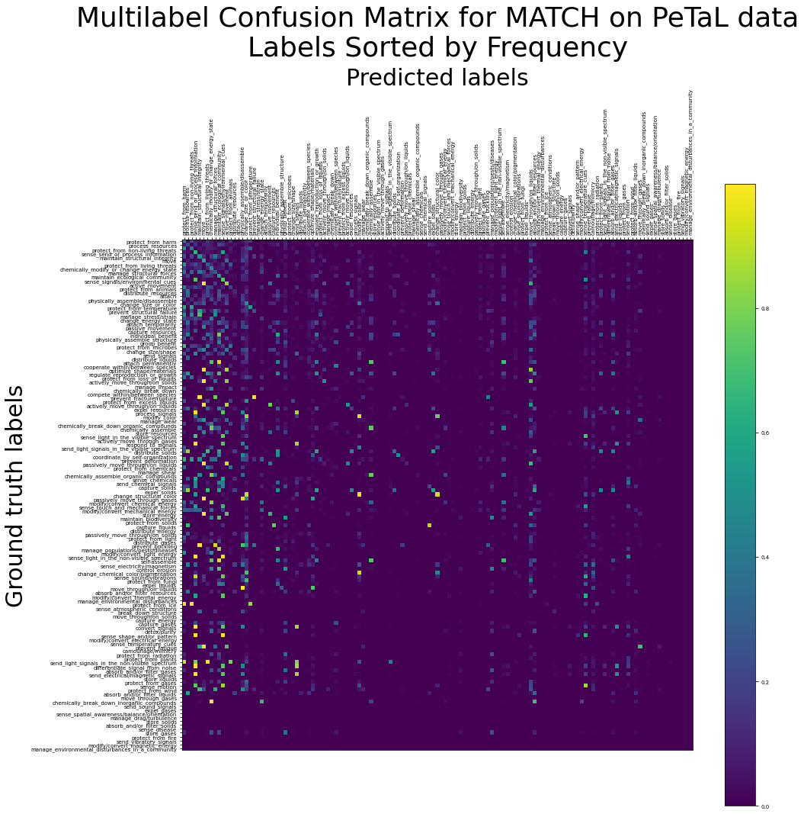
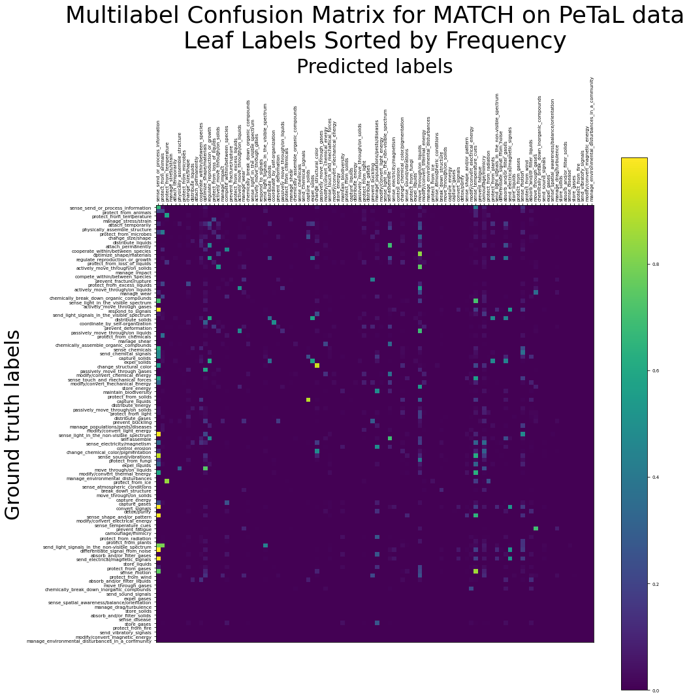
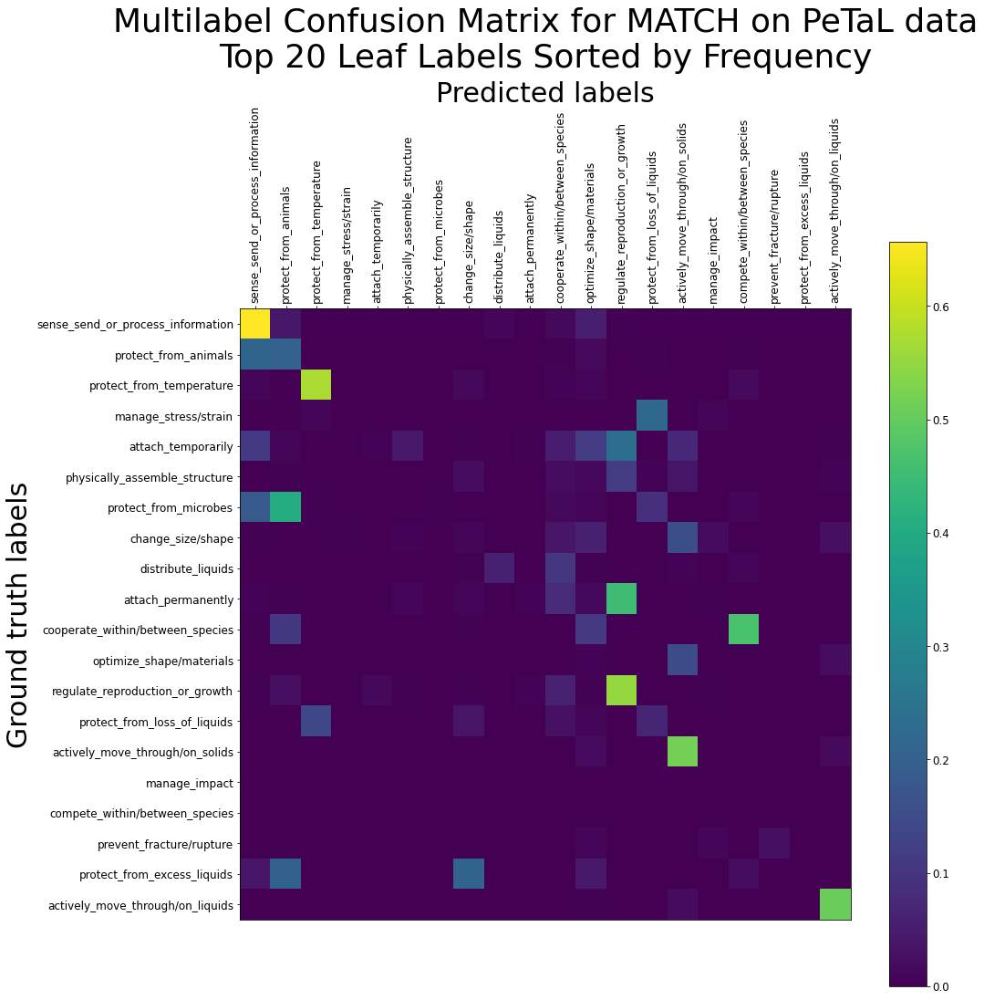
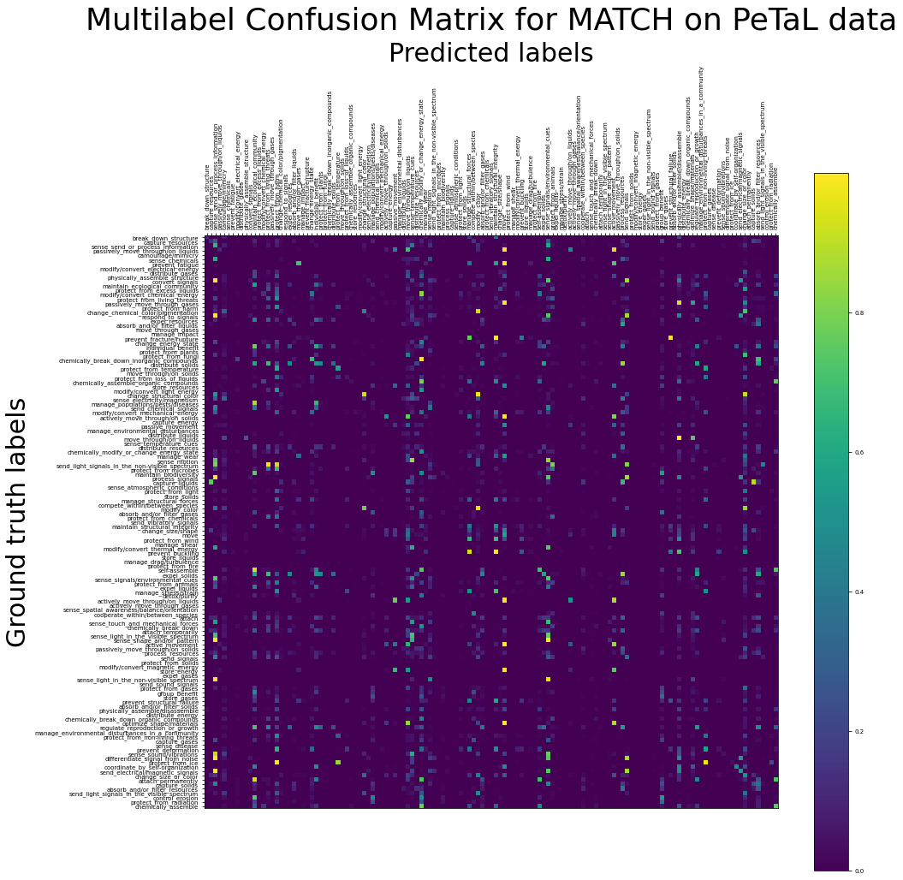

# MATCH on PeTaL Data

## What is this?

This directory contains work done for investigating the use of the MATCH (https://github.com/yuzhimanhua/MATCH) algorithm to classify PeTaL data according to the PeTaL taxonomy.

This README was last updated on 27 July 2021.

## What are all these files?

- `analysis/` contains scripts for analysing experiment data and results.
- `experiment_data/` contains cleaned-up experiment logs for various sets of trials.
- `notebooks/` contains Jupyter notebooks for exploring the use of MATCH on PeTaL data. The source of primary development until roughly 2021-07-14.
- `plots/` contains matplotlib plots generated by `notebooks/prediction_metrics.ipynb`.
- `reports/` contains historical results and analyses thereof, as well as some figures for them in `reports/figures/`.
- `src/` contains python source files and other source files needed for reproducing this work in a non-notebook environment. Probably the source of primary development from 2021-07-14 onward.
- `Makefile` is a simple Makefile for building the setup and cleaning.
- `README.md` is this (self-referential) document.
- `requirements.txt` contains a list of required packages.
- `setup.py`, for setting up preliminaries (i.e., downloading PeTaL).

## How do I reproduce your results?

### Environment and setup

If you haven't done this already, clone this repository and `cd` to here, `PeTaL-Labeller/auto-labeler/MATCH`.

This project is run in Python 3.6. In order to faithfully reproduce our environment, we recommend using a conda environment,

```
conda create --name match-env python=3.6.8
conda activate match-env
```

installing dependencies through pip,

```
pip install -r requirements.txt
```

and downloading the PeTaL dataset using

```
python setup.py [--verbose]
```

or, alternatively,

```
make
```
(which currently just calls `python setup.py --verbose`).

### Running the main MATCH pipeline - preprocessing, training, evaluation

To run the main pipeline, navigate to `src/` and follow its README. In short, this will be

```
cd src
python run_MATCH_with_PeTaL_data.py --cnf config.yaml [--verbose]
```

or, step by step,

```
cd src
python preprocess.py --cnf config.yaml [--verbose]
python train.py --cnf config.yaml [--verbose]
python eval.py --cnf config.yaml [--verbose]
```

where `[--verbose]` is an optional parameter.

### Everybody clean up!

There is also the command

```
make clean
```

should you want to remove the dataset that `setup.py` downloaded. This is necessary if you want to download an updated version of the dataset.

## Summary of results

In short, what I've found so far seems to indicate that:
- for the scale of our data in `PeTaL/cleaned_lens_output.json` (up to 1000 papers), dataset size matters a lot. This is encouraging.
- among other metadata, appending MAG fields of study and MeSH terms to text does help accuracy. MAG fields of study alone give somewhat more information than MeSH terms alone.

Cleaned experiment logs for various sets of trials are found in `experiment_data/`.

Historical analyses of results are available in `reports/results_up_to_20210714.md`.

### 2021-07-27 Multilabel Confusion Matrices - `golden.json`.

We plot multilabel confusion matrices for the top 25% of leaf labels for MATCH on `golden.json`, for issues #65 and #70.


### 2021-07-27 Increasing the number of transformer layers on `golden.json`

| Train set options | P@1=nDCG@1 | P@3 | P@5 | nDCG@3 | nDCG@5 |
| --- | --- | --- | --- | --- | --- |
| golden_3_layer | 0.552 ± 0.108 | 0.471 ± 0.056 | 0.365 ± 0.045 | 0.495 ± 0.068 | 0.487 ± 0.064 |
| golden_4_layer | 0.597 ± 0.059 | 0.489 ± 0.041 | 0.392 ± 0.031 | 0.521 ± 0.045 | 0.523 ± 0.040 |

### 2021-07-27 Dataset size testing on `golden.json`

Although we report no improvement over the equivalent tests on `cleaned_lens_output.json`, we confirm that MATCH performance increases roughly linearly with respect to dataset size on `golden.json`.

| Train set size | P@1=nDCG@1 | P@3 | P@5 | nDCG@3 | nDCG@5 |
| --- | --- | --- | --- | --- | --- |
| 248 | 0.315 ± 0.020 | 0.242 ± 0.022 | 0.208 ± 0.012 | 0.262 ± 0.022 | 0.273 ± 0.016 |
| 364 | 0.394 ± 0.062 | 0.303 ± 0.048 | 0.248 ± 0.037 | 0.326 ± 0.053 | 0.331 ± 0.052 |
| 481 | 0.437 ± 0.076 | 0.360 ± 0.064 | 0.286 ± 0.046 | 0.381 ± 0.069 | 0.380 ± 0.065 |
| 597 | 0.510 ± 0.031 | 0.405 ± 0.027 | 0.321 ± 0.019 | 0.434 ± 0.028 | 0.431 ± 0.027 |
| 713 | 0.515 ± 0.046 | 0.415 ± 0.036 | 0.332 ± 0.029 | 0.443 ± 0.039 | 0.444 ± 0.039 |
| 829 | 0.568 ± 0.044 | 0.468 ± 0.039 | 0.366 ± 0.027 | 0.496 ± 0.039 | 0.492 ± 0.036 |
| 945 | 0.580 ± 0.050 | 0.478 ± 0.043 | 0.373 ± 0.030 | 0.508 ± 0.045 | 0.501 ± 0.043 |

### 2021-07-26 First Tests on `golden.json` - Issue #70

We conducted three sets of ten trials. The first involved the whole `golden.json` dataset. The second and third involved only the papers labelled with one of the top 25% and top 10% leaf labels, respectively, for PeTaL Labeller Issue #70.

| Train set options | Dataset size | P@1=nDCG@1 | P@3 | P@5 | nDCG@3 | nDCG@5 |
| --- | --- | --- | --- | --- | --- | --- |
| golden_testing | 1161 | 0.552 ± 0.108 | 0.471 ± 0.056 | 0.365 ± 0.045 | 0.495 ± 0.068 | 0.487 ± 0.064 |
| golden_top_25% | 773 | 0.526 ± 0.093 | 0.461 ± 0.074 | 0.357 ± 0.044 | 0.491 ± 0.077 | 0.522 ± 0.069 |
| golden_top_10% | 453 | 0.471 ± 0.113 | 0.274 ± 0.043 | 0.207 ± 0.024 | 0.558 ± 0.092 | 0.626 ± 0.081 |

It seems that the advantage gained by restricting the papers to only the most common labels is outweighed by the disadvantage of having a smaller dataset. Also observe that the nDCG scores increase as the dataset becomes more restricted -- this could be a consequence of the model learning to predict those labels correctly more often, or it could be a consequence of there being fewer labels to predict (and thus, fewer incorrect choices).

### 2021-07-22 Multilabel Confusion Matrices - A Closer Look

In the following confusion matrix we sort the labels by the frequency by which they appear in the training subset. Observe that the more frequent labels occur at the left and at the top (and these are by and large the parent labels, such as `move` and `sense_send_or_process_information` or the like).



Filtering for leaf labels only gives the following plot:



And a close-up of the top 20 leaf labels is here:



Do note that we have not dropped any labels at the training stage, so all of these plots come from the same training/evaluation results. The filtering came at the plotting stage -- the last two plots are just filtered versions of the first plot.

### 2021-07-21 Multilabel Confusion Matrix - How Each Label is Classified

In this confusion matrix we plot the average probability of predicting a *predicted label* based on what *ground truth label* is present in the test set. Bright spots indicate probabilities closer to 1, and darker spots indicate probabilities closer to 0. 



The (slight) diagonal bright streak indicates the probability of assigning a predicted label to the a paper with that same ground truth label. Observe that some parent-label ("Level I") columns (e.g., `move` and `sense_send_or_process_information`) have lots of bright spots down the column. This is expected, as all of their leaf labels should correctly have their parent labels also predicted in their papers.

Because there are 131 labels in this matrix, it is a very big diagram, and it's also very unwieldy. Future work in confusion matrix visualization may focus on a subset of such labels (perhaps the most common ones).

### 2021-07-20 The Effect of Each Metadatum on MATCH Performance

We ran ablation studies to determine the effect of each metadatum on MATCH performance. One study removed each metadatum separately from the full set of training evidence; another complementary study used training evidence consisting only of each metadatum taken separately.

| Train set options | P@1=nDCG@1 | P@3 | P@5 | nDCG@3 | nDCG@5 |
| --- | --- | --- | --- | --- | --- |
| everything | 0.591 ± 0.043 | 0.452 ± 0.036 | 0.359 ± 0.027 | 0.492 ± 0.036 | 0.487 ± 0.033 |
| all_except_author | 0.568 ± 0.068 | 0.440 ± 0.042 | 0.349 ± 0.027 | 0.478 ± 0.048 | 0.475 ± 0.039 |
| all_except_venue | 0.543 ± 0.129 | 0.423 ± 0.105 | 0.333 ± 0.071 | 0.456 ± 0.111 | 0.449 ± 0.101 |
| all_except_refs | 0.569 ± 0.068 | 0.436 ± 0.044 | 0.341 ± 0.038 | 0.472 ± 0.049 | 0.463 ± 0.050 |
| all_except_text | 0.494 ± 0.070 | 0.394 ± 0.059 | 0.310 ± 0.043 | 0.421 ± 0.063 | 0.414 ± 0.056 |
| all_except_mag | 0.571 ± 0.087 | 0.439 ± 0.064 | 0.344 ± 0.043 | 0.477 ± 0.069 | 0.468 ± 0.063 |
| all_except_mesh | 0.586 ± 0.104 | 0.443 ± 0.059 | 0.350 ± 0.045 | 0.482 ± 0.069 | 0.475 ± 0.063 |

| Train set options | P@1=nDCG@1 | P@3 | P@5 | nDCG@3 | nDCG@5 |
| --- | --- | --- | --- | --- | --- |
| only_author | 0.381 ± 0.051 | 0.316 ± 0.041 | 0.255 ± 0.026 | 0.335 ± 0.041 | 0.336 ± 0.037 |
| only_venue | 0.301 ± 0.049 | 0.236 ± 0.021 | 0.201 ± 0.015 | 0.250 ± 0.024 | 0.258 ± 0.025 |
| only_refs | 0.467 ± 0.053 | 0.377 ± 0.041 | 0.311 ± 0.031 | 0.404 ± 0.047 | 0.411 ± 0.043 |
| only_text | 0.550 ± 0.082 | 0.423 ± 0.072 | 0.336 ± 0.053 | 0.458 ± 0.075 | 0.454 ± 0.069 |
| only_mag | 0.498 ± 0.034 | 0.393 ± 0.024 | 0.312 ± 0.029 | 0.420 ± 0.026 | 0.415 ± 0.028 |
| only_mesh | 0.409 ± 0.067 | 0.313 ± 0.046 | 0.264 ± 0.029 | 0.338 ± 0.050 | 0.348 ± 0.043 |
| nothing | 0.307 ± 0.047 | 0.221 ± 0.036 | 0.193 ± 0.012 | 0.239 ± 0.038 | 0.250 ± 0.026 |

### 2021-07-19 Ablation Studies: MAG vs. MeSH vs. Everything Else

*"Everything Else" includes references, author, venue, and text*.

| MAG | MeSH | Everything Else | P@1=nDCG@1 | P@3 | P@5 | nDCG@3 | nDCG@5 |
| --- | --- | --- | --- | --- | --- | --- | --- |
| no | no | no | 0.307 ± 0.047 | 0.221 ± 0.036 | 0.193 ± 0.012 | 0.239 ± 0.038 | 0.250 ± 0.026 |
| yes | no | no | 0.498 ± 0.034 | 0.393 ± 0.024 | 0.312 ± 0.029 | 0.420 ± 0.026 | 0.415 ± 0.028 |
| no | yes | no | 0.409 ± 0.067 | 0.313 ± 0.046 | 0.264 ± 0.029 | 0.338 ± 0.050 | 0.348 ± 0.043 |
| yes | yes | no | 0.533 ± 0.065 | 0.432 ± 0.045 | 0.345 ± 0.040 | 0.461 ± 0.044 | 0.455 ± 0.046 |
| no | no | yes | 0.582 ± 0.064 | 0.450 ± 0.047 | 0.343 ± 0.042 | 0.486 ± 0.048 | 0.471 ± 0.055 |
| yes | no | yes | 0.586 ± 0.104 | 0.443 ± 0.059 | 0.350 ± 0.045 | 0.482 ± 0.069 | 0.475 ± 0.063 |
| no | yes | yes | 0.571 ± 0.087 | 0.439 ± 0.064 | 0.344 ± 0.043 | 0.477 ± 0.069 | 0.468 ± 0.063 |
| yes | yes | yes | 0.591 ± 0.043 | 0.452 ± 0.036 | 0.359 ± 0.027 | 0.492 ± 0.036 | 0.487 ± 0.033 |

In a nutshell, this suggests that MAG fields of study give more information than MeSH terms.

### 2021-07-15: Preliminary tests after getting MATCH to stop ignoring MAG and MeSH terms:

| Train set options | P@1=nDCG@1 | P@3 | P@5 | nDCG@3 | nDCG@5 |
| --- | --- | --- | --- | --- | --- |
| before modfying PeTaL.joint.emb | 0.590 ± 0.040 | 0.457 ± 0.030 | 0.369 ± 0.025 | 0.495 ± 0.032 | 0.493 ± 0.035 |
| after modifying PeTaL.joint.emb | 0.614 ± 0.051 | 0.474 ± 0.041 | 0.370 ± 0.027 | 0.510 ± 0.041 | 0.519 ± 0.038 |
| after modifying emb_init.npy, vocab.npy | 0.577 ± 0.041 | 0.433 ± 0.034 | 0.339 ± 0.026 | 0.470 ± 0.034 | 0.476 ± 0.034 |

## Future work

- Integrate this work with the rest of the PeTaL pipeline.
- Compare to auto-sklearn (https://github.com/nasa-petal/PeTaL-labeller/issues/56)
- Investigate using just the most common subset of labels (https://github.com/nasa-petal/PeTaL-labeller/issues/69, https://github.com/nasa-petal/PeTaL-labeller/issues/70) to see if MATCH does better on that.
- Look into data augmentation techniques.
- conda throws a non-fatal error at the beginning of training? Not sure why, but it still trains well.

## Contact

For questions contact Eric Kong (eric.l.kong@nasa.gov, erickongl@gmail.com).