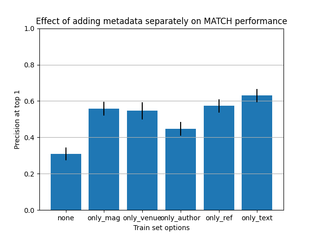

# MATCH on PeTaL Data

## Links

- [What is this?](#overview)
- [What are all these files?](#contents)
- [How do I reproduce your results?](#run)
- [Summary of Results](#results)
- [Frequently Asked Questions](#faq)
- [Future Work](#future)
- [Contact](#contact)

## What is this? <a name="overview"></a>

This directory contains work done for investigating the use of the MATCH (https://github.com/yuzhimanhua/MATCH) algorithm to classify PeTaL data according to the PeTaL taxonomy.

This README was last updated on 16 August 2021.

## What are all these files? <a name="contents"></a>

- `analysis/` contains scripts for analysing experiment data and results.
- `experiment_data/` contains cleaned-up experiment logs for various sets of trials.
- `notebooks/` contains Jupyter notebooks for exploring the use of MATCH on PeTaL data. The source of primary development until roughly 2021-07-14.
- `plots/` contains matplotlib plots generated by `notebooks/prediction_metrics.ipynb`.
- `reports/` contains historical results and analyses thereof, as well as some figures for them in `reports/figures/`.
- `src/` contains python source files and other source files needed for reproducing this work in a non-notebook environment. Probably the source of primary development from 2021-07-14 onward.
- `Makefile` is a simple Makefile for building the setup and cleaning.
- `README.md` is this (self-referential) document.
- `requirements.txt` contains a list of required packages.
- `setup.py`, for setting up preliminaries (i.e., downloading PeTaL).

## How do I reproduce your results? <a name="run"></a>

### Environment and setup

If you haven't done this already, clone this repository and `cd` to here, `PeTaL-Labeller/auto-labeler/MATCH`.

This project is run in Python 3.6. In order to faithfully reproduce our environment, we recommend using a conda environment,

```
conda create --name match-env python=3.6.8
conda activate match-env
```

installing dependencies through pip,

```
pip install -r requirements.txt
```

and downloading the PeTaL dataset using

```
python setup.py [--verbose]
```

or, alternatively,

```
make
```
(which currently just calls `python setup.py --verbose`).

### Running the main MATCH pipeline - preprocessing, training, evaluation

To run the main pipeline, navigate to `src/` and follow its README. In short, this will be

```
cd src
python run_MATCH_with_PeTaL_data.py --cnf config.yaml [--verbose]
```

or, step by step,

```
cd src
python preprocess.py --cnf config.yaml [--verbose]
python train.py --cnf config.yaml [--verbose]
python eval.py --cnf config.yaml [--verbose]
```

where `[--verbose]` is an optional parameter.

The trained model will appear in `src/MATCH/PeTaL/models/` and its predictions will appear in `src/MATCH/PeTaL/results/`. The top 5 predictions will also appear in `src/MATCH/predictions.txt` for each test example.

### Running embedding pretraining

This should not be necessary with [the current dataset](https://drive.google.com/file/d/1dTA7h0KAf1bBU40Anpfjg_VMJ_I4JXUQ/view?usp=sharing), which comes with pretrained embeddings in the file `src/MATCH/PeTaL/PeTaL.joint.emb`.

However, if you are creating a new dataset or modifying an existing one, you may have to run embedding pretraining. The MATCH authors provide a [procedure](https://github.com/yuzhimanhua/MATCH#embedding-pre-training) for this. This involves downloading and installing the [GSL](https://drive.google.com/file/d/1UvmgrZbycC7wYAHahYGRB5pRtu6Aurhv/view?usp=sharing) package (in their description). It may be necessary to append the path to your GSL installation to `LD_LIBRARY_PATH`, as follows:

```
LD_LIBRARY_PATH=$LD_LIBRARY_PATH:/path/to/gsl/lib
export LD_LIBRARY_PATH
```

### Everybody clean up!

There is also the command

```
make clean
```

should you want to remove the dataset that `setup.py` downloaded. This is necessary if you want to download an updated version of the dataset.

## Summary of results <a name="results"></a>

In short, what I've found so far seems to indicate that:
- for the scale of our data in `PeTaL/golden.json` (roughly 1200 papers), dataset size matters a lot. This is encouraging.
- among other metadata, appending MAG fields of study and MeSH terms to text does help accuracy. MAG fields of study alone give somewhat more information than MeSH terms alone.
- for now, MATCH is quite definitely overfitting on `PeTaL/golden.json`.

Cleaned experiment logs for various sets of trials are found in `experiment_data/`.

Historical analyses of results are available in [`reports/results_up_to_20210714.md`](reports/results_up_to_20210714.md), [`reports/results_up_to_20210723.md`](reports/results_up_to_20210723.md), and [`reports/results_up_to_20210802.md`](reports/results_up_to_20210802.md).

### 2021-08-10 Batch size 8 - Multilabel Confusion Matrices

For comparison, we have generated [what the multilabel confusion matrices are supposed to look like if MATCH is functioning ideally](reports/ideal_mcms.md).

Below we present the multilabel confusion matrices with "soft scores" for each paper and label, in the sense that MATCH generates probabilities between 0 and 1 for each paper and label and we average these probabilities for each pixel in the grid. Examples using "hard scores" for each paper, where each soft score is converted to 0.0 or 1.0 based on whether it passes a threshold, can be found in [this directory](plots/20210810_MCM/) for thresholds of 0.1, 0.2, and 0.5.

#### All Levels <a name='all'> </a>

Here's the multilabel confusion matrix (hereafter *MCM*) for all labels across all levels:


Zooming in on the top 25 of all labels:


#### Leaf Labels <a name='leaf'> </a>

And here's the MCM for only the leaf labels. Notice the lack of most yellow chatter off the diagonal -- the leaf labels generally are uncorrelated (save for a few exceptions) and do not co-occur with each other.


Zooming in on the top 25 of leaf labels:


#### Level 1 Labels <a name='level1'> </a>

And finally, the MCM amongst level 1 labels has a fair signal along the diagonal, demonstrating that MATCH is indeed learning representations of each of these high-level labels.


In all graphs, the labels are sorted by their frequency of occurrence in my current version of `golden.json`.

### 2021-08-09 Batch size 8 - Only Level 1 Labels

In the PeTaL taxonomy there are ten Level 1 labels. Their frequencies of occurrence in `golden.json` are plotted in the following graph.


The following are the precisions and nDCG scores of MATCH on only the level 1 labels. P@3, P@5, nDCG@3, and nDCG@5 are largely without meaning, because most papers have only one level 1 label. The performance is roughly on par with MATCH performance on the entire tree of labels; I am not sure why it is not higher.

| Train set options | P@1=nDCG@1 | P@3 | P@5 | nDCG@3 | nDCG@5 |
| --- | --- | --- | --- | --- | --- |
| level 1 | 0.678 ± 0.040 | 0.362 ± 0.019 | 0.248 ± 0.013 | 0.742 ± 0.023 | 0.782 ± 0.023 |
| all labels | 0.693 ± 0.047 | 0.546 ± 0.028 | 0.428 ± 0.027 | 0.586 ± 0.028 | 0.579 ± 0.030 |

P@k refers to precision at top k and nDCG@k refers to Normalized Discounted Cumulative Gain at top k. For more detail on what these are see the [FAQ](#p-and-ndcg).

This is a marked improvement for P@1 over the previous Level 1 label tests, which had an average performance below.

| Train set options | P@1=nDCG@1 | P@3 | P@5 | nDCG@3 | nDCG@5 |
| --- | --- | --- | --- | --- | --- |
| level1 | 0.621 ± 0.032 | 0.339 ± 0.025 | 0.239 ± 0.015 | 0.684 ± 0.030 | 0.732 ± 0.027 |

### 2021-08-09 Data Augmentation

We perform data augmentation on `golden.json` by producing `N` copies of each paper, each of whose titles and abstracts are perturbed slightly by replacing some words with their synonyms (according to vector similarity using WordNet). The following results suggest that data augmentation did not produce an advantage, despite taking longer to train.

| Train set augmentation factor | P@1=nDCG@1 | P@3 | P@5 | nDCG@3 | nDCG@5 |
| --- | --- | --- | --- | --- | --- |
| 1x (no augmentation) | 0.710 ± 0.050 | 0.561 ± 0.023 | 0.442 ± 0.022 | 0.602 ± 0.032 | 0.596 ± 0.033 |
| 2x | 0.710 ± 0.039 | 0.591 ± 0.032 | 0.456 ± 0.024 | 0.624 ± 0.033 | 0.610 ± 0.028 |
| 3x | 0.731 ± 0.032 | 0.591 ± 0.030 | 0.467 ± 0.023 | 0.629 ± 0.031 | 0.622 ± 0.029 |
| 4x | 0.683 ± 0.033 | 0.567 ± 0.034 | 0.449 ± 0.020 | 0.601 ± 0.036 | 0.597 ± 0.033 |
| 5x | 0.709 ± 0.018 | 0.563 ± 0.020 | 0.447 ± 0.018 | 0.603 ± 0.017 | 0.597 ± 0.023 |

P@k refers to precision at top k and nDCG@k refers to Normalized Discounted Cumulative Gain at top k. For more detail on what these are see the [FAQ](#p-and-ndcg).

These results are plotted below.


### 2021-08-07 Batch size 8 - Size Testing

We run more granular size testing on MATCH using a batch size optimized for `golden.json`. We find that the linear increase of MATCH's performance with respect to dataset size is not quite linear -- although the increase is still monotonic, the slope begins to taper off, suggesting that linear increases in dataset size may not help as much as we initially thought. This is expected, in that it is natural that these metrics, which range from 0 to 1, will have to reach a plateau at some point. That plateau has not been reached, but the rate of increase is slowing down.

| Train set options | Train set size | P@1=nDCG@1 | P@3 | P@5 | nDCG@3 | nDCG@5 |
| --- | --- | --- | --- | --- | --- | --- |
| batch_8_0.05 | 74 | 0.296 ± 0.040 | 0.231 ± 0.022 | 0.193 ± 0.015 | 0.247 ± 0.025 | 0.251 ± 0.022 |
| batch_8_0.10 | 132 | 0.364 ± 0.045 | 0.286 ± 0.010 | 0.233 ± 0.009 | 0.305 ± 0.015 | 0.307 ± 0.014 |
| batch_8_0.15 | 190 | 0.428 ± 0.045 | 0.329 ± 0.020 | 0.268 ± 0.016 | 0.352 ± 0.024 | 0.355 ± 0.023 |
| batch_8_0.20 | 248 | 0.484 ± 0.020 | 0.363 ± 0.011 | 0.288 ± 0.008 | 0.393 ± 0.011 | 0.389 ± 0.008 |
| batch_8_0.25 | 306 | 0.516 ± 0.039 | 0.385 ± 0.034 | 0.308 ± 0.025 | 0.418 ± 0.035 | 0.416 ± 0.033 |
| batch_8_0.30 | 364 | 0.551 ± 0.022 | 0.413 ± 0.012 | 0.328 ± 0.009 | 0.449 ± 0.015 | 0.445 ± 0.012 |
| batch_8_0.35 | 422 | 0.560 ± 0.038 | 0.429 ± 0.019 | 0.341 ± 0.013 | 0.463 ± 0.024 | 0.460 ± 0.021 |
| batch_8_0.40 | 481 | 0.582 ± 0.057 | 0.444 ± 0.028 | 0.350 ± 0.022 | 0.481 ± 0.032 | 0.476 ± 0.031 |
| batch_8_0.45 | 539 | 0.615 ± 0.024 | 0.473 ± 0.019 | 0.371 ± 0.017 | 0.510 ± 0.020 | 0.503 ± 0.020 |
| batch_8_0.50 | 597 | 0.629 ± 0.031 | 0.473 ± 0.020 | 0.373 ± 0.017 | 0.514 ± 0.023 | 0.509 ± 0.023 |
| batch_8_0.55 | 655 | 0.645 ± 0.024 | 0.500 ± 0.019 | 0.393 ± 0.011 | 0.538 ± 0.017 | 0.532 ± 0.014 |
| batch_8_0.60 | 713 | 0.647 ± 0.017 | 0.498 ± 0.025 | 0.388 ± 0.023 | 0.539 ± 0.023 | 0.530 ± 0.025 |
| batch_8_0.65 | 771 | 0.665 ± 0.023 | 0.510 ± 0.022 | 0.404 ± 0.019 | 0.551 ± 0.023 | 0.546 ± 0.025 |
| batch_8_0.70 | 829 | 0.678 ± 0.026 | 0.529 ± 0.019 | 0.414 ± 0.018 | 0.570 ± 0.020 | 0.562 ± 0.020 |
| batch_8_0.75 | 887 | 0.672 ± 0.021 | 0.532 ± 0.031 | 0.414 ± 0.022 | 0.571 ± 0.026 | 0.562 ± 0.024 |
| batch_8_0.80 | 945 | 0.689 ± 0.034 | 0.541 ± 0.033 | 0.421 ± 0.027 | 0.582 ± 0.034 | 0.573 ± 0.033 |
| batch_8_0.85 | 1003 | 0.702 ± 0.053 | 0.552 ± 0.046 | 0.430 ± 0.040 | 0.592 ± 0.046 | 0.581 ± 0.052 |

P@k refers to precision at top k and nDCG@k refers to Normalized Discounted Cumulative Gain at top k. For more detail on what these are see the [FAQ](#p-and-ndcg).

These results are plotted below.


### 2021-08-07 Batch size 8 - Ablation Studies

We ran a full suite of ablation studies and size tests to confirm the relationships we have observed [previously](#results) after fixing `golden.json`.

| Train set options | P@1=nDCG@1 | P@3 | P@5 | nDCG@3 | nDCG@5 |
| --- | --- | --- | --- | --- | --- |
| batch_8_all | 0.689 ± 0.048 | 0.541 ± 0.041 | 0.426 ± 0.026 | 0.581 ± 0.040 | 0.575 ± 0.033 |
| batch_8_no_mag | 0.692 ± 0.032 | 0.546 ± 0.039 | 0.423 ± 0.033 | 0.586 ± 0.038 | 0.575 ± 0.042 |
| batch_8_no_mesh | 0.702 ± 0.030 | 0.554 ± 0.033 | 0.429 ± 0.026 | 0.594 ± 0.032 | 0.583 ± 0.031 |
| batch_8_no_venue | 0.660 ± 0.088 | 0.508 ± 0.064 | 0.403 ± 0.050 | 0.548 ± 0.070 | 0.542 ± 0.067 |
| batch_8_no_author | 0.688 ± 0.045 | 0.541 ± 0.039 | 0.428 ± 0.026 | 0.582 ± 0.039 | 0.577 ± 0.034 |
| batch_8_no_ref | 0.696 ± 0.044 | 0.528 ± 0.036 | 0.420 ± 0.021 | 0.573 ± 0.036 | 0.570 ± 0.028 |
| batch_8_no_text | 0.659 ± 0.032 | 0.527 ± 0.030 | 0.417 ± 0.023 | 0.563 ± 0.031 | 0.559 ± 0.028 |
| batch_8_only_mag | 0.558 ± 0.039 | 0.445 ± 0.036 | 0.352 ± 0.026 | 0.475 ± 0.035 | 0.472 ± 0.030 |
| batch_8_only_mesh | 0.308 ± 0.035 | 0.225 ± 0.020 | 0.195 ± 0.014 | 0.242 ± 0.021 | 0.252 ± 0.017 |
| batch_8_only_venue | 0.546 ± 0.048 | 0.480 ± 0.038 | 0.400 ± 0.035 | 0.498 ± 0.036 | 0.512 ± 0.031 |
| batch_8_only_author | 0.447 ± 0.037 | 0.339 ± 0.025 | 0.279 ± 0.022 | 0.364 ± 0.025 | 0.368 ± 0.021 |
| batch_8_only_ref | 0.573 ± 0.036 | 0.447 ± 0.029 | 0.361 ± 0.020 | 0.480 ± 0.028 | 0.481 ± 0.024 |
| batch_8_only_text | 0.630 ± 0.036 | 0.484 ± 0.026 | 0.390 ± 0.025 | 0.524 ± 0.028 | 0.526 ± 0.032 |
| batch_8_none | 0.308 ± 0.035 | 0.224 ± 0.020 | 0.193 ± 0.021 | 0.241 ± 0.023 | 0.250 ± 0.023 |

P@k refers to precision at top k and nDCG@k refers to Normalized Discounted Cumulative Gain at top k. For more detail on what these are see the [FAQ](#p-and-ndcg).

These results are plotted below.




### 2021-08-06 Batch size testing

We discover that optimizing the training batch size on `golden.json` increases MATCH's performance significantly on all metrics! This was initially surprising, but a possible explanation and intuition for why training batch size might matter is [here](https://medium.com/mini-distill/effect-of-batch-size-on-training-dynamics-21c14f7a716e).

| Training batch size | P@1=nDCG@1 | P@3 | P@5 | nDCG@3 | nDCG@5 |
| --- | --- | --- | --- | --- | --- |
| 4 | 0.694 ± 0.061 | 0.539 ± 0.060 | 0.425 ± 0.044 | 0.581 ± 0.059 | 0.575 ± 0.055 |
| 8 | 0.698 ± 0.050 | 0.545 ± 0.034 | 0.425 ± 0.025 | 0.586 ± 0.036 | 0.576 ± 0.031 |
| 16 | 0.688 ± 0.041 | 0.533 ± 0.032 | 0.421 ± 0.028 | 0.575 ± 0.030 | 0.570 ± 0.028 |
| 32 | 0.661 ± 0.042 | 0.530 ± 0.036 | 0.420 ± 0.031 | 0.567 ± 0.035 | 0.564 ± 0.036 |
| 64 | 0.655 ± 0.052 | 0.512 ± 0.049 | 0.402 ± 0.037 | 0.552 ± 0.048 | 0.545 ± 0.048 |
| 128 | 0.614 ± 0.045 | 0.478 ± 0.038 | 0.375 ± 0.035 | 0.515 ± 0.038 | 0.508 ± 0.042 |
| 256 | 0.590 ± 0.058 | 0.467 ± 0.050 | 0.370 ± 0.042 | 0.502 ± 0.050 | 0.502 ± 0.052 |

P@k refers to precision at top k and nDCG@k refers to Normalized Discounted Cumulative Gain at top k. For more detail on what these are see the [FAQ](#p-and-ndcg).

These results are plotted below.


### 2021-08-02 Idealized Multilabel Confusion Matrices

We generate [what the multilabel confusion matrices are supposed to look like if MATCH is functioning ideally](reports/ideal_mcms.md).

## Frequently Asked Questions <a name="faq"></a>

### What do P@1, P@3, nDCG@1, etc., all mean? <a name="p-and-ndcg"></a>

So MATCH produces a ranking of labels (biomimicry functions) by their relevance. There are a lot of labels, but usually only a few are relevant to each document. **Precision at top k** (P@k) asks "Of the top k labels predicted by MATCH, how many is the document actually (ground-truth) tagged with"?

P@k has a shortcoming in that it is not ranking-aware -- it just checks, one by one, whether each predicted label is also a ground-truth label (whereas in reality, some labels can be more relevant than others!). **Normalized Discounted Cumulative Gain at top k** (nDCG@k) is one way to address this issue, by computing the similarity of MATCH's generated ranking to an ideal ranking.

Both P@k and nDCG@k range from 0.0 (completely off the mark) to 1.0 (picture-perfect).

### What values does nDCG use for an ideal ranking, since we don't have relevancy scores for our labels? <a name="ndcg-ranking"></a>

My understanding is the relevancy score for each ground-truth label is a binary yes or no (1 for relevant, 0 for not).

The ordering of the predictions that MATCH makes can still have an effect on the nDCG score, though!

For example, consider two relevant labels (R) and an irrelevant label (NR). If for a certain paper, a prediction at top 3 is (NR, R, R) and another is (R, NR, R) (where R = a relevant label and NR is a non-relevant label), those two predictions would have different nDCG scores. In computing the nDCG score they would both be compared to the ideal partial ordering (R, R, NR).

## Future work <a name="future"></a>

- Integrate this work with the rest of the PeTaL pipeline.
- Compare to [auto-sklearn](https://github.com/nasa-petal/PeTaL-labeller/issues/56)
- Investigate using just the [most common subset of labels](https://github.com/nasa-petal/PeTaL-labeller/issues/70) to see if MATCH does better on that, and write a [binary classifier to filter out the other labels](https://github.com/nasa-petal/PeTaL-labeller/issues/69).
- Continue looking into [data augmentation techniques](https://github.com/nasa-petal/PeTaL-labeller/issues/65).
- conda throws a non-fatal error at the beginning of training? Not sure why, but it still trains well.
- Figure out how to load MATCH with [pretrained weights](https://github.com/nasa-petal/PeTaL-labeller/issues/72).

## Contact <a name="contact"></a>

For questions contact Eric Kong (eric.l.kong@nasa.gov, erickongl@gmail.com).