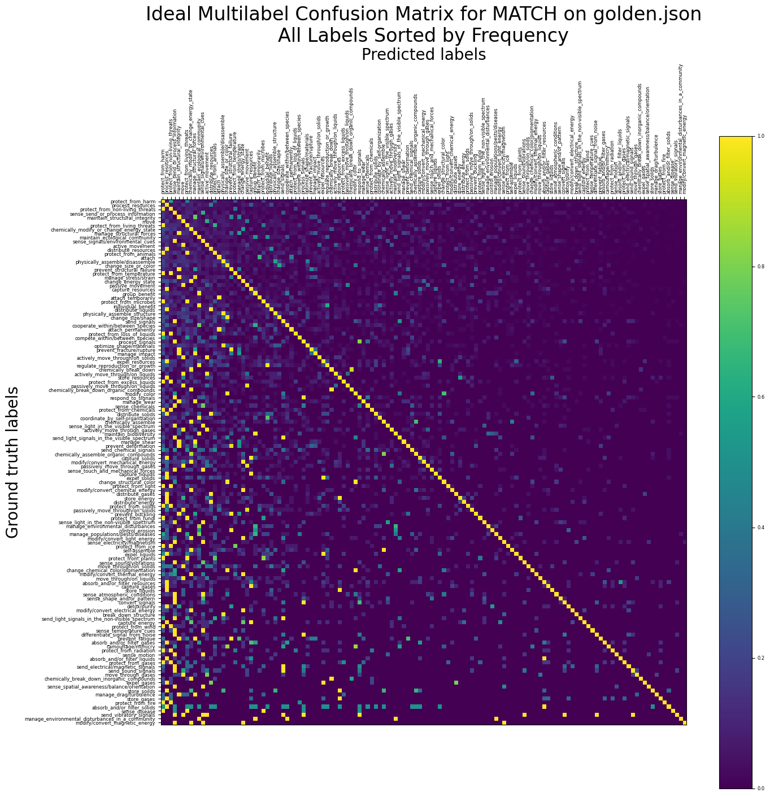
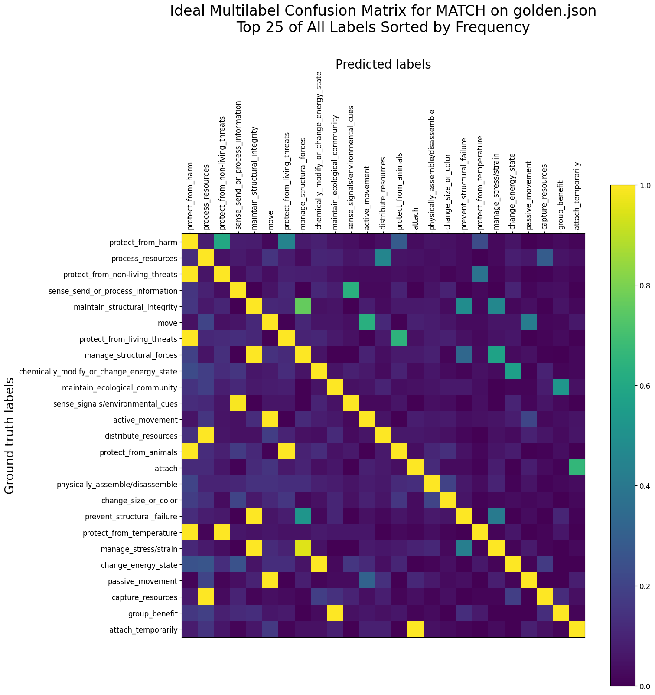
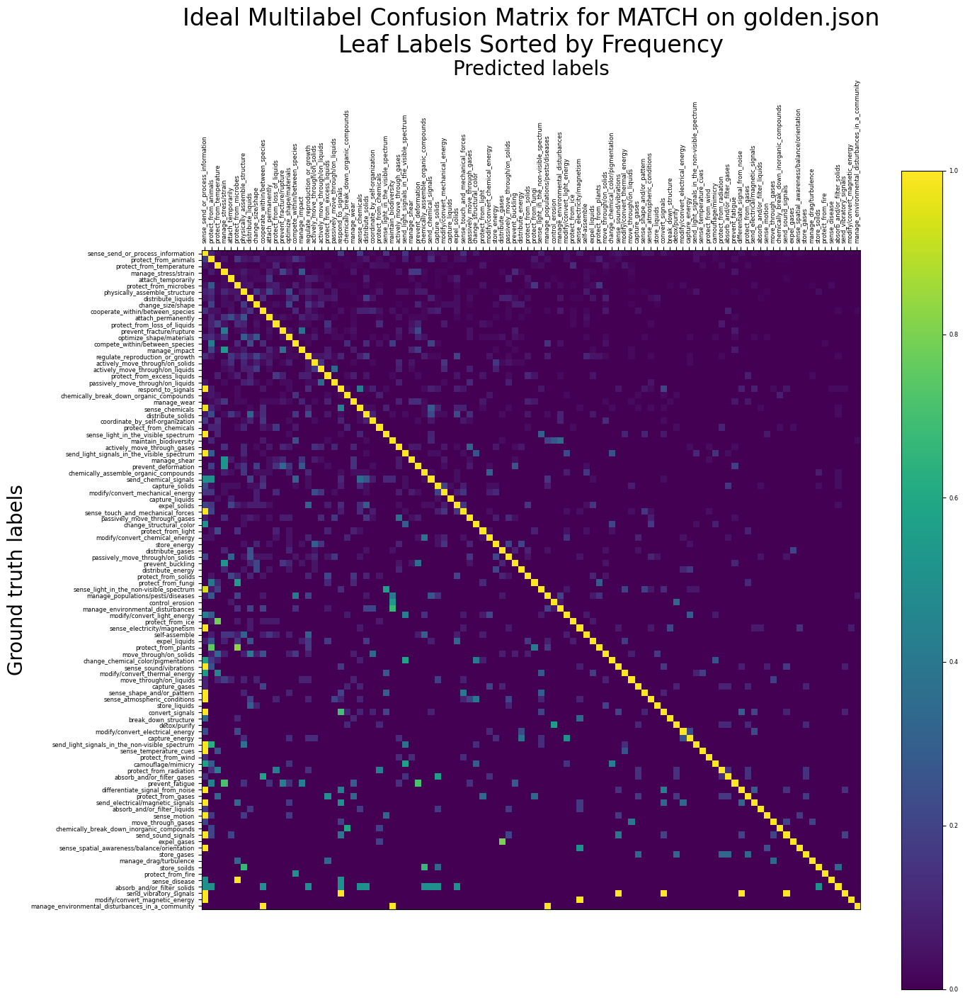
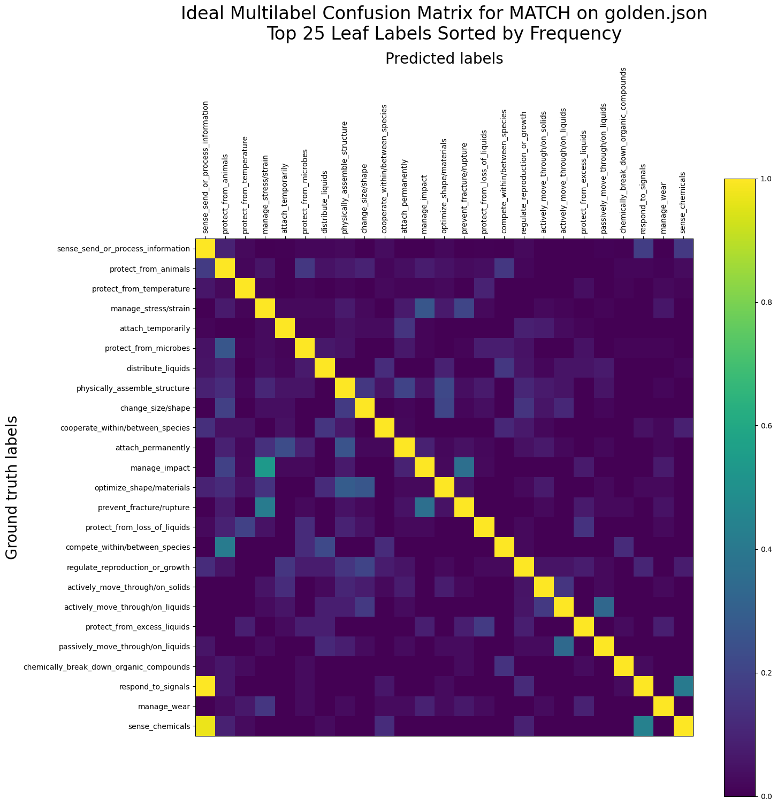
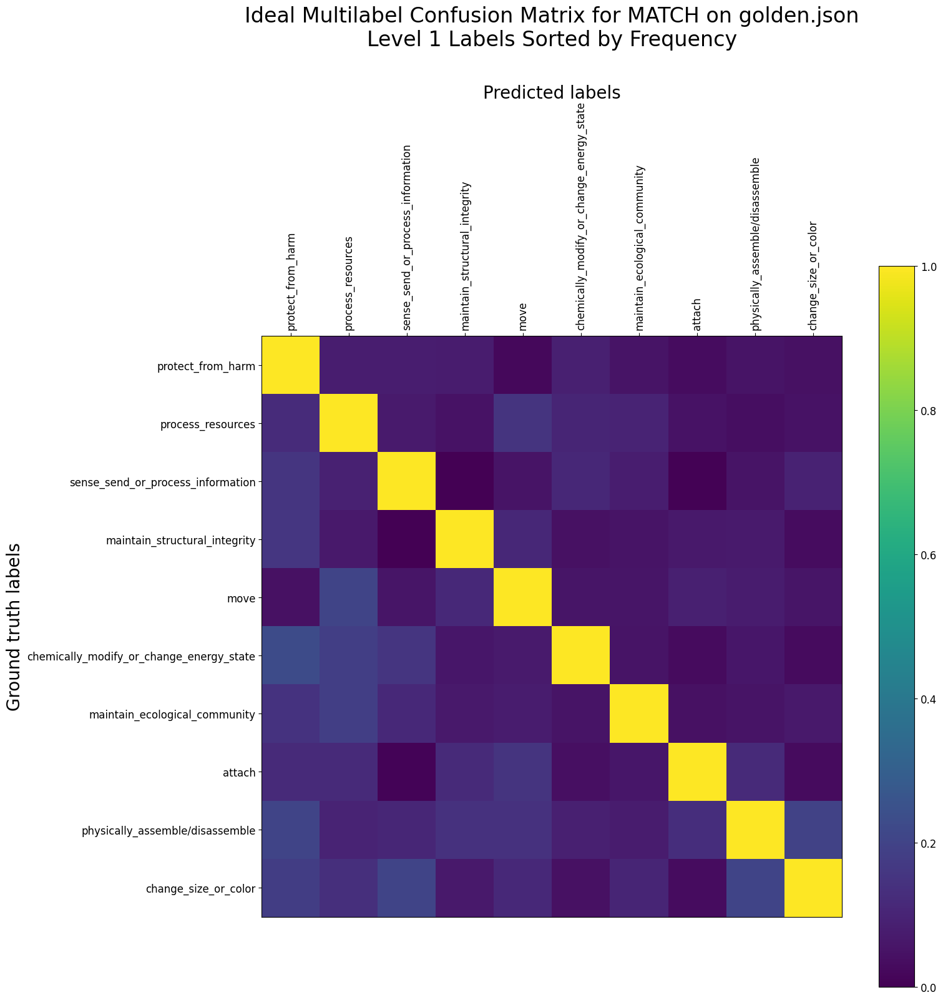

# Ideal Multilabel Confusion Matrices

## What Is This?

In this document, I have generated *idealized* multilabel confusion matrices so as to better see the correlations between labels in our dataset. These multilabel confusion matrices, generated using `../analysis/ideal_MCM.py`, are what would be seen if our multilabel classifer were absolutely 100% correct in each and every one of its predictions.

This report was last modified on 2 August 2021.

## Links

- [All Levels](#all)
- [Leaf Labels](#leaf)
- [Level 1 Labels](#level1)

## The Matrices

### All Levels 

Here's the multilabel confusion matrix (hereafter *MCM*) for all labels across all levels:

Zooming in on the top 25 of all labels:

### Leaf Labels 

And here's the MCM for only the leaf labels. Notice the lack of most yellow chatter off the diagonal -- the leaf labels generally are uncorrelated (save for a few exceptions) and do not co-occur with each other.

Zooming in on the top 25 of leaf labels:

### Level 1 Labels 

And finally, the ideal MCM amongst level 1 labels (protect from harm, process resources) shows that they're actually pretty much independent (i.e., most papers have only 1 top-level label), with only a few dim correlations:

In all graphs, the labels are sorted by their frequency of occurrence in my current version of `golden.json`.