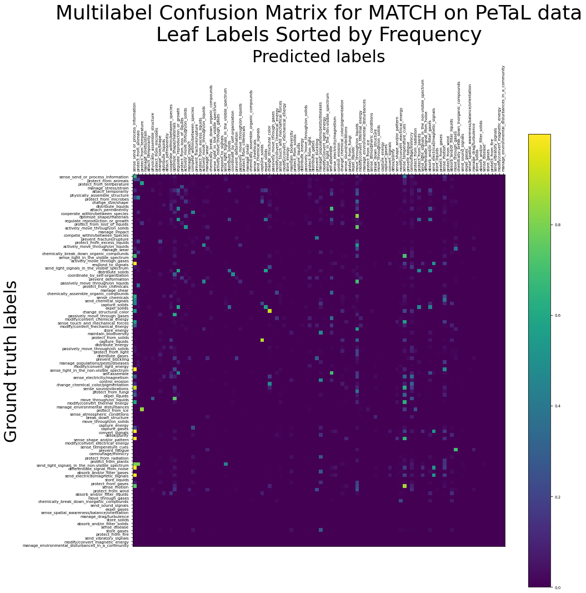
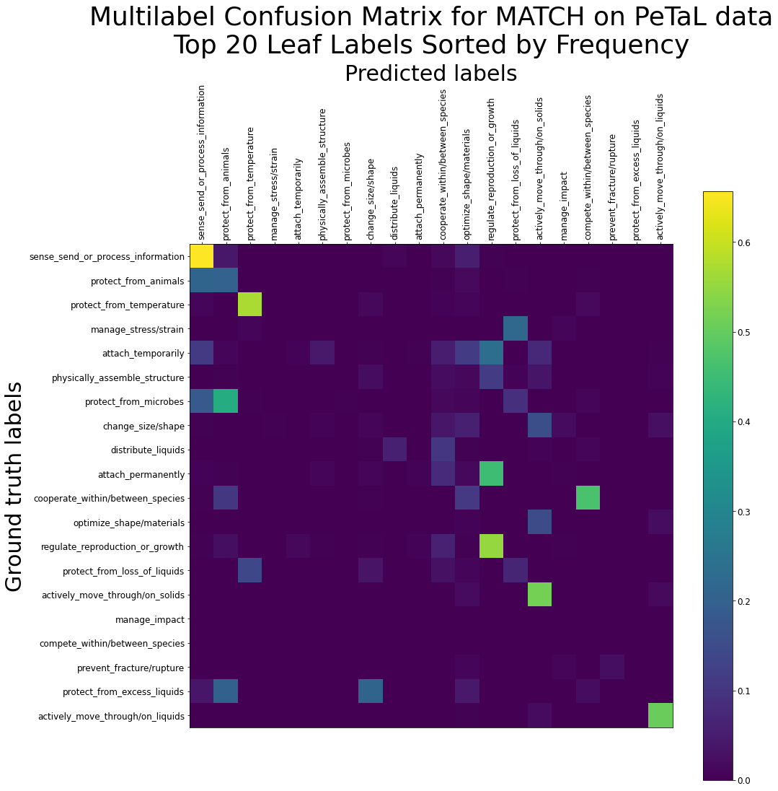

# MATCH on PeTaL Data - Results up to 2021-07-23

## What is this?

This document contains results of investigation of MATCH on PeTaL before approximately 2021-07-23. In particular, these data were generated before I switched from running on the dataset `cleaned_lens_output.json` to running on the (first version of the) dataset `golden.json`.

All of the ablation studies whose results are reported here are probably still valid in their conclusions, but comparing numbers directly to those from new tests is discouraged (unless you make it clear that this is a confounder which exists).

This document was last updated on 29 July 2021.

## Historical Results

### 2021-07-22 Multilabel Confusion Matrices - A Closer Look

In the following confusion matrix we sort the labels by the frequency by which they appear in the training subset. Observe that the more frequent labels occur at the left and at the top (and these are by and large the parent labels, such as `move` and `sense_send_or_process_information` or the like).

Filtering for leaf labels only gives the following plot:

And a close-up of the top 20 leaf labels is here:

Do note that we have not dropped any labels at the training stage, so all of these plots come from the same training/evaluation results. The filtering came at the plotting stage -- the last two plots are just filtered versions of the first plot.

### 2021-07-21 Multilabel Confusion Matrix - How Each Label is Classified

In this confusion matrix we plot the average probability of predicting a *predicted label* based on what *ground truth label* is present in the test set. Bright spots indicate probabilities closer to 1, and darker spots indicate probabilities closer to 0. 

The (slight) diagonal bright streak indicates the probability of assigning a predicted label to the a paper with that same ground truth label. Observe that some parent-label ("Level I") columns (e.g., `move` and `sense_send_or_process_information`) have lots of bright spots down the column. This is expected, as all of their leaf labels should correctly have their parent labels also predicted in their papers.

Because there are 131 labels in this matrix, it is a very big diagram, and it's also very unwieldy. Future work in confusion matrix visualization may focus on a subset of such labels (perhaps the most common ones).

### 2021-07-20 The Effect of Each Metadatum on MATCH Performance

We ran ablation studies to determine the effect of each metadatum on MATCH performance. One study removed each metadatum separately from the full set of training evidence; another complementary study used training evidence consisting only of each metadatum taken separately.

| Train set options | P@1=nDCG@1 | P@3 | P@5 | nDCG@3 | nDCG@5 |
| --- | --- | --- | --- | --- | --- |
| everything | 0.591 ± 0.043 | 0.452 ± 0.036 | 0.359 ± 0.027 | 0.492 ± 0.036 | 0.487 ± 0.033 |
| all_except_author | 0.568 ± 0.068 | 0.440 ± 0.042 | 0.349 ± 0.027 | 0.478 ± 0.048 | 0.475 ± 0.039 |
| all_except_venue | 0.543 ± 0.129 | 0.423 ± 0.105 | 0.333 ± 0.071 | 0.456 ± 0.111 | 0.449 ± 0.101 |
| all_except_refs | 0.569 ± 0.068 | 0.436 ± 0.044 | 0.341 ± 0.038 | 0.472 ± 0.049 | 0.463 ± 0.050 |
| all_except_text | 0.494 ± 0.070 | 0.394 ± 0.059 | 0.310 ± 0.043 | 0.421 ± 0.063 | 0.414 ± 0.056 |
| all_except_mag | 0.571 ± 0.087 | 0.439 ± 0.064 | 0.344 ± 0.043 | 0.477 ± 0.069 | 0.468 ± 0.063 |
| all_except_mesh | 0.586 ± 0.104 | 0.443 ± 0.059 | 0.350 ± 0.045 | 0.482 ± 0.069 | 0.475 ± 0.063 |

| Train set options | P@1=nDCG@1 | P@3 | P@5 | nDCG@3 | nDCG@5 |
| --- | --- | --- | --- | --- | --- |
| only_author | 0.381 ± 0.051 | 0.316 ± 0.041 | 0.255 ± 0.026 | 0.335 ± 0.041 | 0.336 ± 0.037 |
| only_venue | 0.301 ± 0.049 | 0.236 ± 0.021 | 0.201 ± 0.015 | 0.250 ± 0.024 | 0.258 ± 0.025 |
| only_refs | 0.467 ± 0.053 | 0.377 ± 0.041 | 0.311 ± 0.031 | 0.404 ± 0.047 | 0.411 ± 0.043 |
| only_text | 0.550 ± 0.082 | 0.423 ± 0.072 | 0.336 ± 0.053 | 0.458 ± 0.075 | 0.454 ± 0.069 |
| only_mag | 0.498 ± 0.034 | 0.393 ± 0.024 | 0.312 ± 0.029 | 0.420 ± 0.026 | 0.415 ± 0.028 |
| only_mesh | 0.409 ± 0.067 | 0.313 ± 0.046 | 0.264 ± 0.029 | 0.338 ± 0.050 | 0.348 ± 0.043 |
| nothing | 0.307 ± 0.047 | 0.221 ± 0.036 | 0.193 ± 0.012 | 0.239 ± 0.038 | 0.250 ± 0.026 |

### 2021-07-19 Ablation Studies: MAG vs. MeSH vs. Everything Else

*"Everything Else" includes references, author, venue, and text*.

| MAG | MeSH | Everything Else | P@1=nDCG@1 | P@3 | P@5 | nDCG@3 | nDCG@5 |
| --- | --- | --- | --- | --- | --- | --- | --- |
| no | no | no | 0.307 ± 0.047 | 0.221 ± 0.036 | 0.193 ± 0.012 | 0.239 ± 0.038 | 0.250 ± 0.026 |
| yes | no | no | 0.498 ± 0.034 | 0.393 ± 0.024 | 0.312 ± 0.029 | 0.420 ± 0.026 | 0.415 ± 0.028 |
| no | yes | no | 0.409 ± 0.067 | 0.313 ± 0.046 | 0.264 ± 0.029 | 0.338 ± 0.050 | 0.348 ± 0.043 |
| yes | yes | no | 0.533 ± 0.065 | 0.432 ± 0.045 | 0.345 ± 0.040 | 0.461 ± 0.044 | 0.455 ± 0.046 |
| no | no | yes | 0.582 ± 0.064 | 0.450 ± 0.047 | 0.343 ± 0.042 | 0.486 ± 0.048 | 0.471 ± 0.055 |
| yes | no | yes | 0.586 ± 0.104 | 0.443 ± 0.059 | 0.350 ± 0.045 | 0.482 ± 0.069 | 0.475 ± 0.063 |
| no | yes | yes | 0.571 ± 0.087 | 0.439 ± 0.064 | 0.344 ± 0.043 | 0.477 ± 0.069 | 0.468 ± 0.063 |
| yes | yes | yes | 0.591 ± 0.043 | 0.452 ± 0.036 | 0.359 ± 0.027 | 0.492 ± 0.036 | 0.487 ± 0.033 |

In a nutshell, this suggests that MAG fields of study give more information than MeSH terms.

### 2021-07-15: Preliminary tests after getting MATCH to stop ignoring MAG and MeSH terms:

| Train set options | P@1=nDCG@1 | P@3 | P@5 | nDCG@3 | nDCG@5 |
| --- | --- | --- | --- | --- | --- |
| before modfying PeTaL.joint.emb | 0.590 ± 0.040 | 0.457 ± 0.030 | 0.369 ± 0.025 | 0.495 ± 0.032 | 0.493 ± 0.035 |
| after modifying PeTaL.joint.emb | 0.614 ± 0.051 | 0.474 ± 0.041 | 0.370 ± 0.027 | 0.510 ± 0.041 | 0.519 ± 0.038 |
| after modifying emb_init.npy, vocab.npy | 0.577 ± 0.041 | 0.433 ± 0.034 | 0.339 ± 0.026 | 0.470 ± 0.034 | 0.476 ± 0.034 |