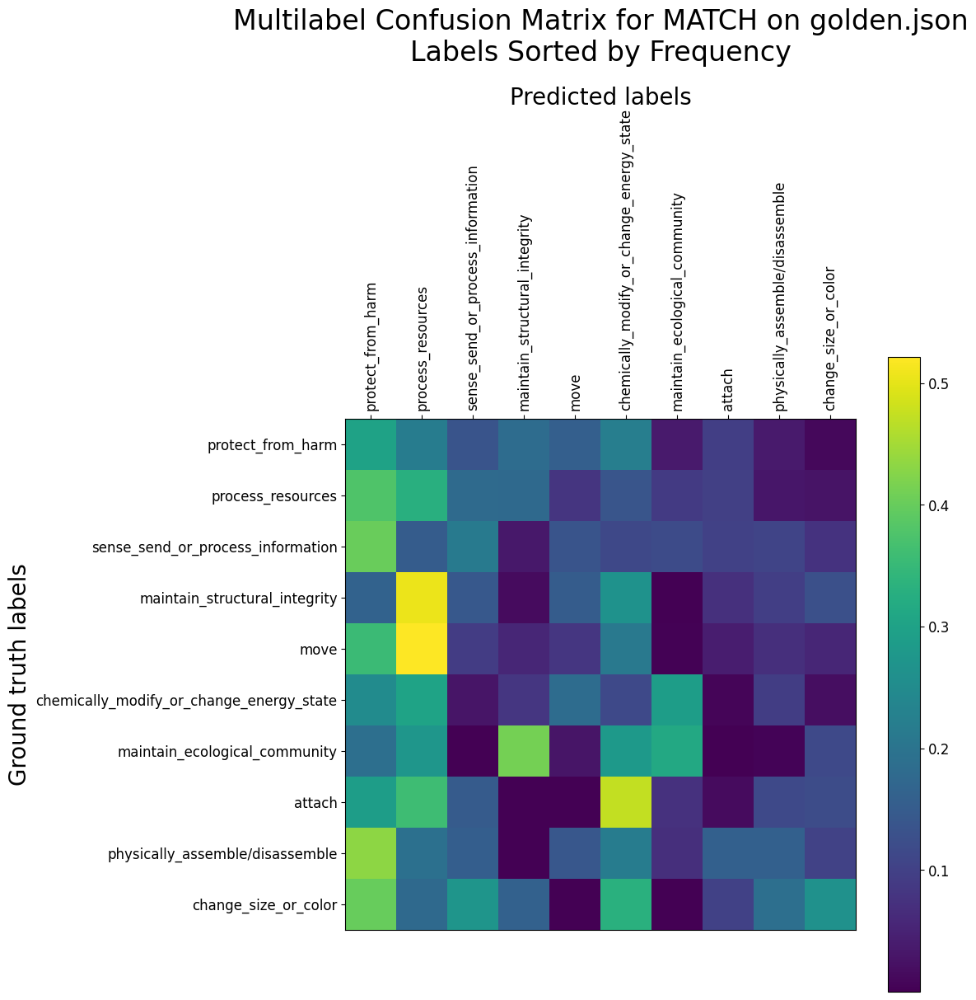
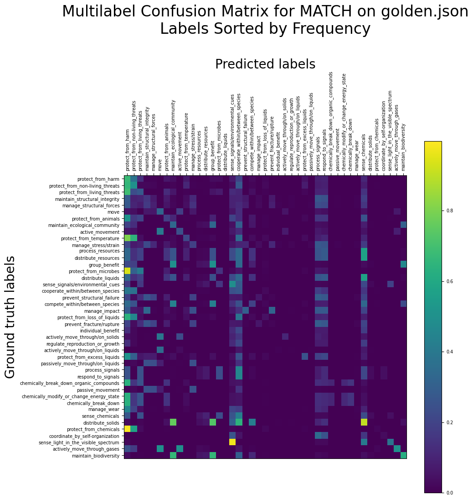

# MATCH on PeTaL Data - Results up to 2021-08-02

## What is this?

This document contains results of investigation of MATCH on PeTaL before approximately 2021-08-02. In particular, these data were generated before I discovered that reducing the training batch size from 256 to 8 significantly improved MATCH's performance on `golden.json`.

All of the ablation studies whose results are reported here are probably still valid in their conclusions, but comparing numbers directly to those from new tests is discouraged (unless you make it clear that this is a confounder which exists).

This document was last updated on 9 August 2021.

## Historical Results

### 2021-08-02 Idealized Multilabel Confusion Matrices

We generate [what the multilabel confusion matrices are supposed to look like if MATCH is functioning ideally](reports/ideal_mcms.md).

### 2021-08-02 Updated ablation studies and size tests

We ran a full suite of ablation studies and size tests to confirm the relationships we have observed [previously](#results) after fixing `golden.json`.

| Train set options | P@1=nDCG@1 | P@3 | P@5 | nDCG@3 | nDCG@5 |
| --- | --- | --- | --- | --- | --- |
| ablation_all | 0.590 ± 0.058 | 0.467 ± 0.050 | 0.370 ± 0.042 | 0.502 ± 0.050 | 0.502 ± 0.052 |
| ablation_no_mag | 0.608 ± 0.068 | 0.484 ± 0.043 | 0.381 ± 0.032 | 0.519 ± 0.047 | 0.515 ± 0.042 |
| ablation_no_mesh | 0.587 ± 0.055 | 0.474 ± 0.061 | 0.373 ± 0.048 | 0.506 ± 0.059 | 0.503 ± 0.059 |
| ablation_no_venue | 0.566 ± 0.044 | 0.451 ± 0.031 | 0.358 ± 0.026 | 0.484 ± 0.033 | 0.483 ± 0.035 |
| ablation_no_author | 0.598 ± 0.037 | 0.479 ± 0.031 | 0.376 ± 0.030 | 0.513 ± 0.032 | 0.507 ± 0.032 |
| ablation_no_ref | 0.597 ± 0.055 | 0.470 ± 0.035 | 0.370 ± 0.038 | 0.504 ± 0.036 | 0.498 ± 0.037 |
| ablation_no_text | 0.587 ± 0.069 | 0.493 ± 0.054 | 0.384 ± 0.032 | 0.521 ± 0.055 | 0.516 ± 0.048 |
| ablation_only_mag | 0.497 ± 0.061 | 0.394 ± 0.043 | 0.313 ± 0.036 | 0.422 ± 0.047 | 0.419 ± 0.048 |
| ablation_only_mesh | 0.308 ± 0.035 | 0.231 ± 0.022 | 0.196 ± 0.011 | 0.247 ± 0.023 | 0.254 ± 0.017 |
| ablation_only_venue | 0.543 ± 0.057 | 0.485 ± 0.040 | 0.399 ± 0.040 | 0.501 ± 0.042 | 0.510 ± 0.040 |
| ablation_only_author | 0.344 ± 0.049 | 0.281 ± 0.033 | 0.233 ± 0.028 | 0.297 ± 0.033 | 0.302 ± 0.032 |
| ablation_only_ref | 0.463 ± 0.064 | 0.378 ± 0.044 | 0.313 ± 0.032 | 0.402 ± 0.048 | 0.411 ± 0.044 |
| ablation_only_text | 0.531 ± 0.050 | 0.396 ± 0.050 | 0.315 ± 0.034 | 0.432 ± 0.051 | 0.428 ± 0.049 |
| ablation_none | 0.308 ± 0.035 | 0.223 ± 0.026 | 0.196 ± 0.020 | 0.242 ± 0.027 | 0.254 ± 0.026 |

| Train set study | Size | P@1=nDCG@1 | P@3 | P@5 | nDCG@3 | nDCG@5 |
| --- | --- | --- | --- | --- | --- | --- |
| sizetest_0.15 | 190 | 0.362 ± 0.051 | 0.269 ± 0.037 | 0.219 ± 0.024 | 0.291 ± 0.042 | 0.295 ± 0.036 |
| sizetest_0.20 | 248 | 0.344 ± 0.051 | 0.255 ± 0.040 | 0.213 ± 0.023 | 0.277 ± 0.044 | 0.283 ± 0.038 |
| sizetest_0.25 | 306 | 0.374 ± 0.068 | 0.277 ± 0.048 | 0.227 ± 0.029 | 0.301 ± 0.054 | 0.304 ± 0.047 |
| sizetest_0.30 | 364 | 0.395 ± 0.068 | 0.309 ± 0.054 | 0.249 ± 0.034 | 0.331 ± 0.058 | 0.333 ± 0.051 |
| sizetest_0.35 | 422 |0.447 ± 0.053 | 0.353 ± 0.046 | 0.279 ± 0.034 | 0.378 ± 0.049 | 0.375 ± 0.047 |
| sizetest_0.40 | 481 | 0.502 ± 0.063 | 0.386 ± 0.055 | 0.303 ± 0.041 | 0.418 ± 0.058 | 0.414 ± 0.056 |
| sizetest_0.45 | 539 | 0.461 ± 0.059 | 0.355 ± 0.036 | 0.284 ± 0.026 | 0.382 ± 0.041 | 0.382 ± 0.039 |
| sizetest_0.50 | 597 | 0.509 ± 0.065 | 0.390 ± 0.064 | 0.309 ± 0.041 | 0.422 ± 0.065 | 0.420 ± 0.058 |
| sizetest_0.55 | 655 | 0.534 ± 0.036 | 0.421 ± 0.030 | 0.332 ± 0.021 | 0.453 ± 0.033 | 0.449 ± 0.029 |
| sizetest_0.60 | 713 | 0.539 ± 0.047 | 0.423 ± 0.029 | 0.335 ± 0.025 | 0.455 ± 0.034 | 0.454 ± 0.033 |
| sizetest_0.65 | 771 | 0.567 ± 0.039 | 0.444 ± 0.035 | 0.354 ± 0.027 | 0.478 ± 0.035 | 0.476 ± 0.034 |
| sizetest_0.70 | 829 | 0.569 ± 0.083 | 0.440 ± 0.074 | 0.346 ± 0.049 | 0.475 ± 0.077 | 0.471 ± 0.068 |
| sizetest_0.75 | 887 | 0.582 ± 0.030 | 0.464 ± 0.042 | 0.365 ± 0.032 | 0.498 ± 0.038 | 0.494 ± 0.035 |
| sizetest_0.80 | 945 | 0.604 ± 0.044 | 0.490 ± 0.037 | 0.388 ± 0.026 | 0.523 ± 0.041 | 0.522 ± 0.038 |
| sizetest_0.85 | 1003 | 0.586 ± 0.038 | 0.464 ± 0.024 | 0.369 ± 0.026 | 0.496 ± 0.022 | 0.491 ± 0.027 |

### 2021-07-28 Issue #73 testing on `golden.json` - Using Only The Labels At The Highest Level.

In the PeTaL taxonomy there are ten Level 1 labels. Their frequencies of occurrence in `golden.json` are plotted in the following graph.

The following are the precisions and nDCG scores of MATCH on only the level 1 labels. P@3, P@5, nDCG@3, and nDCG@5 are largely without meaning, because most papers have only one level 1 label. The performance is roughly on par with MATCH performance on the entire tree of labels; I am not sure why it is not higher.

| Train set options | P@1=nDCG@1 | P@3 | P@5 | nDCG@3 | nDCG@5 |
| --- | --- | --- | --- | --- | --- |
| level1 | 0.621 ± 0.032 | 0.339 ± 0.025 | 0.239 ± 0.015 | 0.684 ± 0.030 | 0.732 ± 0.027 |

P@k refers to precision at top k and nDCG@k refers to Normalized Discounted Cumulative Gain at top k. For more detail on what these are see the [FAQ](#p-and-ndcg).

A multilabel confusion matrix showing what each label tends to be classified as is shown below:

### 2021-07-27 Ablation Studies - `golden.json`.

Overnight we ran the same suite of ablation studies on `golden.json` and obtained the following results.

| Train set options | P@1=nDCG@1 | P@3 | P@5 | nDCG@3 | nDCG@5 |
| --- | --- | --- | --- | --- | --- |
| golden_all | 0.584 ± 0.055 | 0.485 ± 0.032 | 0.382 ± 0.027 | 0.513 ± 0.036 | 0.510 ± 0.034 |
| golden_no_mag | 0.533 ± 0.037 | 0.447 ± 0.029 | 0.352 ± 0.020 | 0.473 ± 0.028 | 0.469 ± 0.024 |
| golden_no_mesh | 0.562 ± 0.057 | 0.472 ± 0.061 | 0.373 ± 0.046 | 0.498 ± 0.060 | 0.495 ± 0.058 |
| golden_no_venue | 0.544 ± 0.044 | 0.437 ± 0.041 | 0.354 ± 0.037 | 0.467 ± 0.042 | 0.471 ± 0.044 |
| golden_no_author | 0.596 ± 0.051 | 0.487 ± 0.038 | 0.379 ± 0.032 | 0.519 ± 0.039 | 0.512 ± 0.040 |
| golden_no_ref | 0.568 ± 0.047 | 0.472 ± 0.053 | 0.373 ± 0.038 | 0.499 ± 0.052 | 0.495 ± 0.046 |
| golden_no_text | 0.571 ± 0.053 | 0.486 ± 0.046 | 0.379 ± 0.037 | 0.511 ± 0.047 | 0.506 ± 0.045 |
| golden_only_mag | 0.519 ± 0.053 | 0.412 ± 0.046 | 0.327 ± 0.032 | 0.440 ± 0.046 | 0.437 ± 0.040 |
| golden_only_mesh | 0.308 ± 0.035 | 0.228 ± 0.022 | 0.194 ± 0.017 | 0.245 ± 0.023 | 0.253 ± 0.019 |
| golden_only_venue | 0.592 ± 0.051 | 0.533 ± 0.039 | 0.434 ± 0.041 | 0.551 ± 0.040 | 0.557 ± 0.039 |
| golden_only_author | 0.362 ± 0.053 | 0.287 ± 0.045 | 0.235 ± 0.027 | 0.307 ± 0.047 | 0.309 ± 0.040 |
| golden_only_ref | 0.449 ± 0.057 | 0.370 ± 0.067 | 0.310 ± 0.051 | 0.392 ± 0.063 | 0.403 ± 0.059 |
| golden_only_text | 0.308 ± 0.035 | 0.231 ± 0.022 | 0.201 ± 0.017 | 0.246 ± 0.022 | 0.258 ± 0.021 |
| golden_none | 0.308 ± 0.035 | 0.230 ± 0.020 | 0.196 ± 0.014 | 0.245 ± 0.021 | 0.255 ± 0.017 |

P@k refers to precision at top k and nDCG@k refers to Normalized Discounted Cumulative Gain at top k. For more detail on what these are see the [FAQ](#p-and-ndcg).

This was alarming, in that *the text itself appeared to be giving no information at all*. It turned out that the text was being lost during the preprocessing stage (because in `golden.json`, there is no `text` field, but just `title` and `abstract` fields) and I had forgotten to account for that. The data involving the `text` field above are therefore flawed, and a fixed set of trials were run, whose results are shown below.

| Train set options | P@1=nDCG@1 | P@3 | P@5 | nDCG@3 | nDCG@5 |
| --- | --- | --- | --- | --- | --- |
| fixed_golden_all | 0.570 ± 0.053 | 0.471 ± 0.035 | 0.370 ± 0.032 | 0.499 ± 0.038 | 0.495 ± 0.039 |
| fixed_golden_no_text | 0.554 ± 0.050 | 0.458 ± 0.043 | 0.364 ± 0.034 | 0.485 ± 0.044 | 0.484 ± 0.041 |
| fixed_golden_only_text | 0.501 ± 0.033 | 0.373 ± 0.029 | 0.294 ± 0.021 | 0.406 ± 0.030 | 0.402 ± 0.027 |

From this we see that text is giving some information, but it does not appreciably improve the final result. (In other words, the metadata give enough information to make the text redundant.)

### 2021-07-27 Multilabel Confusion Matrices - `golden.json`.

We plot multilabel confusion matrices for the top 25% of leaf labels for MATCH on `golden.json`, for issues #65 and #70.

### 2021-07-27 Increasing the number of transformer layers on `golden.json`

We increase the number of transformer layers for MATCH on `golden.json` to see if that makes a difference. Our preliminary investigations seem to indicate that increasing number of layers beyond 4 is not fruitful. In fact, with any more than 6 transformer layers, it is impossible for the GPU on `triglav.grc.nasa.gov` to fit the entire model.

| Train set options | P@1=nDCG@1 | P@3 | P@5 | nDCG@3 | nDCG@5 |
| --- | --- | --- | --- | --- | --- |
| golden_3_layer | 0.552 ± 0.108 | 0.471 ± 0.056 | 0.365 ± 0.045 | 0.495 ± 0.068 | 0.487 ± 0.064 |
| golden_4_layer | 0.597 ± 0.059 | 0.489 ± 0.041 | 0.392 ± 0.031 | 0.521 ± 0.045 | 0.523 ± 0.040 |
| golden_6_layer | 0.597 ± 0.044 | 0.496 ± 0.045 | 0.392 ± 0.037 | 0.525 ± 0.044 | 0.521 ± 0.042 |

P@k refers to precision at top k and nDCG@k refers to Normalized Discounted Cumulative Gain at top k. For more detail on what these are see the [FAQ](#p-and-ndcg).

### 2021-07-27 Dataset size testing on `golden.json`

Although we report no improvement over the equivalent tests on `cleaned_lens_output.json`, we confirm that MATCH performance increases roughly linearly with respect to dataset size on `golden.json`.

| Train set size | P@1=nDCG@1 | P@3 | P@5 | nDCG@3 | nDCG@5 |
| --- | --- | --- | --- | --- | --- |
| 248 | 0.315 ± 0.020 | 0.242 ± 0.022 | 0.208 ± 0.012 | 0.262 ± 0.022 | 0.273 ± 0.016 |
| 364 | 0.394 ± 0.062 | 0.303 ± 0.048 | 0.248 ± 0.037 | 0.326 ± 0.053 | 0.331 ± 0.052 |
| 481 | 0.437 ± 0.076 | 0.360 ± 0.064 | 0.286 ± 0.046 | 0.381 ± 0.069 | 0.380 ± 0.065 |
| 597 | 0.510 ± 0.031 | 0.405 ± 0.027 | 0.321 ± 0.019 | 0.434 ± 0.028 | 0.431 ± 0.027 |
| 713 | 0.515 ± 0.046 | 0.415 ± 0.036 | 0.332 ± 0.029 | 0.443 ± 0.039 | 0.444 ± 0.039 |
| 829 | 0.568 ± 0.044 | 0.468 ± 0.039 | 0.366 ± 0.027 | 0.496 ± 0.039 | 0.492 ± 0.036 |
| 945 | 0.580 ± 0.050 | 0.478 ± 0.043 | 0.373 ± 0.030 | 0.508 ± 0.045 | 0.501 ± 0.043 |

P@k refers to precision at top k and nDCG@k refers to Normalized Discounted Cumulative Gain at top k. For more detail on what these are see the [FAQ](#p-and-ndcg).

### 2021-07-26 First Tests on `golden.json` - Issue #70

We conducted three sets of ten trials. The first involved the whole `golden.json` dataset. The second and third involved only the papers labelled with one of the top 25% and top 10% leaf labels, respectively, for PeTaL Labeller Issue #70.

| Train set options | Dataset size | P@1=nDCG@1 | P@3 | P@5 | nDCG@3 | nDCG@5 |
| --- | --- | --- | --- | --- | --- | --- |
| golden_testing | 1161 | 0.552 ± 0.108 | 0.471 ± 0.056 | 0.365 ± 0.045 | 0.495 ± 0.068 | 0.487 ± 0.064 |
| golden_top_25% | 773 | 0.526 ± 0.093 | 0.461 ± 0.074 | 0.357 ± 0.044 | 0.491 ± 0.077 | 0.522 ± 0.069 |
| golden_top_10% | 453 | 0.471 ± 0.113 | 0.274 ± 0.043 | 0.207 ± 0.024 | 0.558 ± 0.092 | 0.626 ± 0.081 |

P@k refers to precision at top k and nDCG@k refers to Normalized Discounted Cumulative Gain at top k. For more detail on what these are see the [FAQ](#p-and-ndcg).

It seems that the advantage gained by restricting the papers to only the most common labels is outweighed by the disadvantage of having a smaller dataset. Also observe that the nDCG scores increase as the dataset becomes more restricted -- this could be a consequence of the model learning to predict those labels correctly more often, or it could be a consequence of there being fewer labels to predict (and thus, fewer incorrect choices).

## Frequently Asked Questions 

### What do P@1, P@3, nDCG@1, etc., all mean? 

So MATCH produces a ranking of labels (biomimicry functions) by their relevance. There are a lot of labels, but usually only a few are relevant to each document. **Precision at top k** (P@k) asks "Of the top k labels predicted by MATCH, how many is the document actually (ground-truth) tagged with"?

P@k has a shortcoming in that it is not ranking-aware -- it just checks, one by one, whether each predicted label is also a ground-truth label (whereas in reality, some labels can be more relevant than others!). **Normalized Discounted Cumulative Gain at top k** (nDCG@k) is one way to address this issue, by computing the similarity of MATCH's generated ranking to an ideal ranking.

Both P@k and nDCG@k range from 0.0 (completely off the mark) to 1.0 (picture-perfect).

### What values does nDCG use for an ideal ranking, since we don't have relevancy scores for our labels? 

My understanding is the relevancy score for each ground-truth label is a binary yes or no (1 for relevant, 0 for not).

The ordering of the predictions that MATCH makes can still have an effect on the nDCG score, though!

For example, consider two relevant labels (R) and an irrelevant label (NR). If for a certain paper, a prediction at top 3 is (NR, R, R) and another is (R, NR, R) (where R = a relevant label and NR is a non-relevant label), those two predictions would have different nDCG scores. In computing the nDCG score they would both be compared to the ideal partial ordering (R, R, NR).