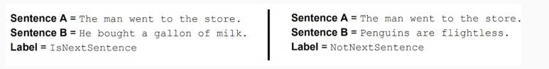

Getting Started
===================
There are two types of NLP Models available, Mask Language Models and Casual Language Models. Both heavily use transformers to do their predictions. The difference is HOW these models are trained. 

Background - Mask Language Model (Bert)
******************************************
Bert was created by Google to understand human language. Different implementations of bert exists for various scienticifc 

Mask Learning
-------------------
The foundation of Petal-Labeller is based on Bert a masked language model. A masked language model is trained on sentences where a certain percentage of words are replaced with [MASK]; in the case of Bert, 15% is replaced with then [MASK] token. 
Bert predicts what word is in the mask should be similar to how the next word in your text messages are predicted. 

Next Sentence prediction
---------------------------
Bert learns the relationship between sentences by predicting whether sentence B is something that proceeds sentence A or is it a random sentence. 
    

Getting Access to Bert
-----------------------------
HuggingFace is the best and worst library for NLP. They have examples but not all of them are up to date or well documented. 
..huggingface: https://huggingface.co/transformers/examples.html 

Resources
-------------
..Bert Slides: https://nlp.stanford.edu/seminar/details/jdevlin.pdf 

Background - Casual Language Model (GPT3 or Casual Bert)
******************************************************************
One of the first examples of the casual language model is GPT - Generative Pre-trained transformers. It was created by OpenAI and can generate texts that are hard to distinguish from an actual human. Think of a chatbot. This model is often use for translation.

Training
------------
GPT is trained by predicting the next token in the sequence instead of what is in a [MASK]. It uses absolute position embeddings. 
It is definitely not worth training GPT3 from scratch. Need 700GB of memory lol. 

Differences from Mask Language Models
---------------------------------------
Bert needs to be tuned for downstream tasks. GPT does not need that. 

Resources 
-------------
- `Casual Bert <https://arxiv.org/abs/2012.05453>`__
- `OpenAI GPT3 <https://www.twilio.com/blog/ultimate-guide-openai-gpt-3-language-model>`__
- `GPT3 size <https://lambdalabs.com/blog/demystifying-gpt-3/>`__

Petal-Labeller (Bert)
******************************************
`Petal-Labeller <https://github.com/nasa-petal/PeTaL-labeller/tree/main/auto-labeler/scibert>` uses scibert to train a classifier on matching abstracts with predefined single labels.

