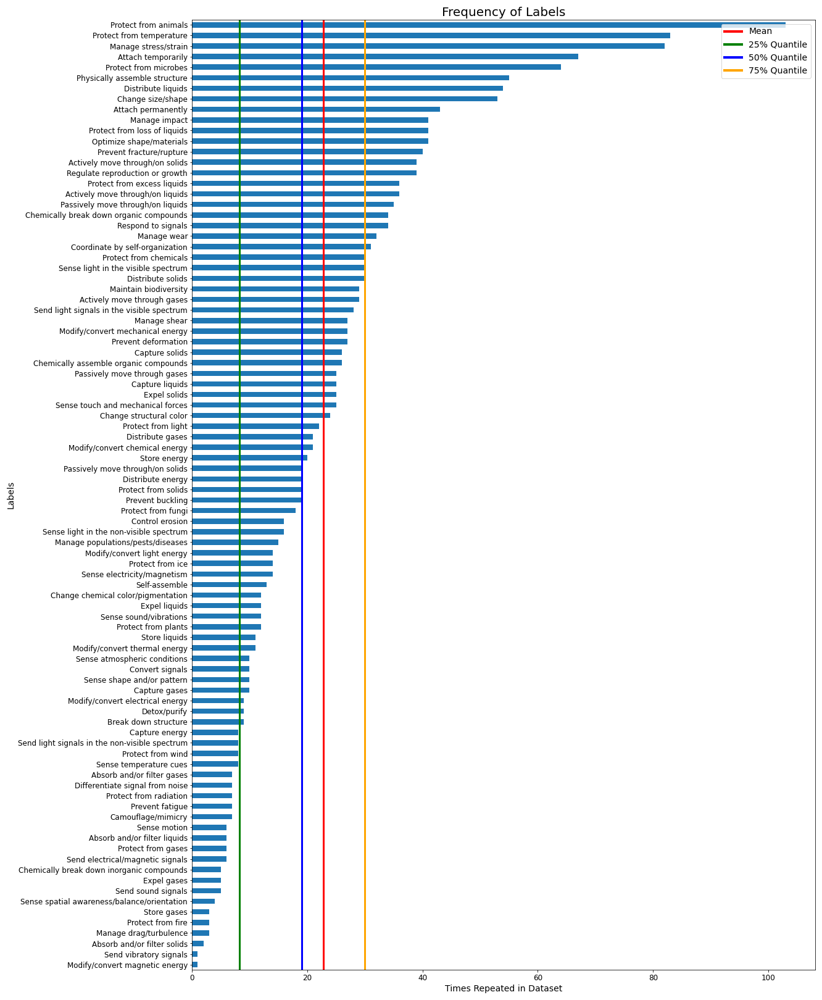

# Data Analysis of the PeTaL Labeled Dataset

## What is it?

This notebook has been developed to explore our labeled dataset and reveal any information which will help us improve the dataset and potentially increase the accuracy of our NLP labelers.

## How do I run it?

The notebook will take our labeled datset (named as "labeled_data.csv") and our taxonomy csv (named as "taxonomy.csv") and will return a histogram and some metrics which show the distribution of labels within our dataset. Simply place these two datasets into this directory with similar names and press "run all". Upon completion, the file will return a CSV containing the labels' absolute counts, percentage of total counts and number of words within the label.

## Current Results

As these results will change as we improve our dataset, a history of summaries of our past results will be available at the top of the notebook.

### 07-01-2021
Focusing only on leaf node labels, 8% of our unique labels account for 27.29% of the total amount of labels used. Additionally 26% of our unique labels are used less than 10 times. Some of the best practices dictated from organizations such as Google are:
- A dataset should have at least 10 examples of a label to ensure the model is able to learn it.
- Labels should have a similar number of examples to prevent the model from overfitting.

### Suggested Next Steps
It may help our model short-term to remove underused labels and to trim overused labels. The better solution is to balance out our dataset by increasing the amount of examples representing the underused labels and to simply have more data.

### Label Distribution
Total number of unique labels (will be known as x): 100 
Total number of used labels (will be known as y): 2056

Count of unique labels used more than 50 times: 8 
Total count of labels used more than 50 times (will be known as a): 561 
a/y =  27.29%

Count of unique labels used less than or equal to 50 times: 82 
Total count of labels used less than 50 times (will be known as b): 1495 
b/y = 72.71%

Count of unique labels used less than 10 times (will be known as c): 26 
c/x = 26.00%

